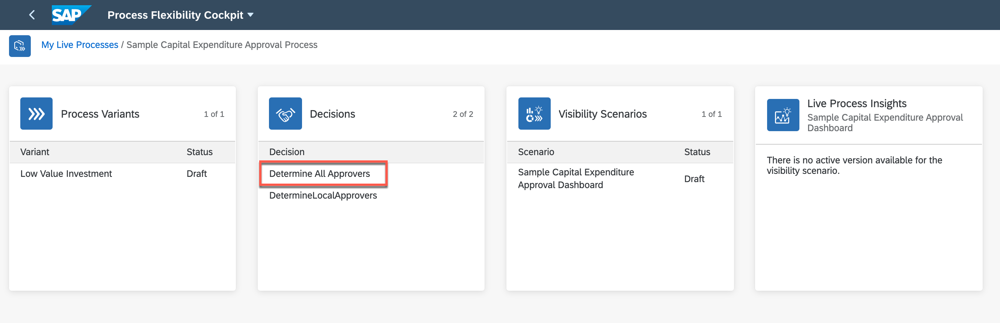
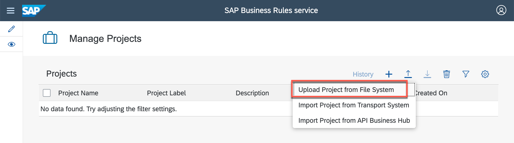
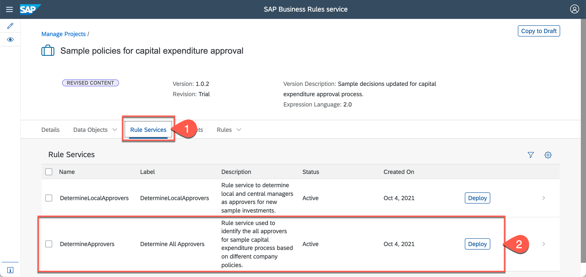

# Setting up your development landscape

- [Overview](#section1-overview)
- [Setup Business Technology Platform Using Booster](#section1-setup)
- [Configure Destination](#section1-configure)
- [Import Sample Content](#section1-import)
- [Troubleshooting](#section1-troubleshooting)

## Overview 

In this course, you will be using your SAP Business Technology Platform Trial account. You will learn how to model, manage and monitor workflow, business rules and process visibility and process flexibility capabilities of Workflow Management. 

**SAP Workflow Management** is a cloud offering from SAP which constitutes different capabilities that helps you to digitize your processes and decisions, and to get and end-to-end visibility into your processes. Not only this we are accelerating the productivity with infusion of intelligent technologies like Intelligent RPA, Conversational AI and providing ways to flexibly configure & extend the processes in a no-code low-code environment. 

Before you start with the exercises, setting up your SAP BTP trial account is an important prerequisite. With Booster, we have now fully automated the setup of workflow, business rules, process visibility and workflow management services in SAP BTP environment. It does the following tasks which you would have otherwise done manually:  

  
As part of the initial setup, you will do the following to make your trial account ready to get started:  
- Run the Workflow Management Booster. 
- Configure destinations to update your trial password.
- Import & deploy sample workflow management scenario. 
> This sample process content contains pre-built workflow, business rules and process visibility. These contents will be used in the exercises

## Setup Business Technology Platform Using Booster 

Follow the tutorial to setup your account using Booster:

https://developers.sap.com/tutorials/cp-starter-ibpm-employeeonboarding-1-setup.html

## Configure Destination 

> **WM_CF_SPACE_PROVIDER** destination is used in *Process Flexibility Cockpit* while importing the sample content from API Business Hub. This destination is already created in the previous set up tutorial, and now you will configure the destination for the password.

1. From your trial global account page, click the tile to access your subaccount where you want have run the booster.
2. To update the password of the destination, do the following:
3. Click **Connectivity | Destinations** from the left-hand navigation.
4. Search for the destination with name **WM_CF_SPACE_PROVIDER**. 
5. In *Destination Configuration* section, 
      - Click **Edit** and enter your trial user password
6. Click **Save** 
      
> Caution: Ensure that the Two Factor Authentication is disabled for the user whose username and password are entered in the destination configuration. If not, then register a new user with 2FA disabled. 
      
  
      

## Import Sample Content 

1.	In your sub-account, do the following:
      - Click **Instances and Subscriptions**, from the left-panel.
      - In *Subscriptions* section, click on application link for SAP Workflow Management.
      
      

      

3.	From the Workflow Management Launchpad, click **Process Flexibility Cockpit** tile.

      

4.  Click **Discover Packages**

      

5.  Search for *sample* and click on **Sample Capital Expenditure Approval Process** to navigate into the content package.

      

6.  Read the content overview to get information of the content and click on **Import**. 

      
      
   
    > In the **Import Package** popup that comes, click on **Import** to continue. 
       > 
      
    > Wait for the content to import. It will take 2-3 minutes for the content to be imported.
       > 
    

9.	Click on **My Live Processes** link on top left to go back the to Live Processes dashboard.
    > Once the content is import successfully, you will see the *Import* button changes to *Configure*.

      

10. Click on the **Sample Capital Expenditure Approval Process** to navigate into the package to activate the business rules.

      

11. As you go into the package, click on **Determine All Approvers** rule from **Decisions** tile. 

      

12. In the **Manage Decisions** application, click on **Activate**. 
    
    >This will activate and deploy the business rules in your trial account. 
    
    

## Troubleshooting 

##### Symptom: Import of the sample package fails with this error as the user has 2FA enabled

1. Download [SampleCapitalExpenditureApprovalRules.zip](https://github.com/SAP-samples/teched2020-DEV163/blob/main/exercises/Exercise0/) rules project.

2. From the *Workflow Management Launchpad*, click **Manage Rule Projects** tile.

    

3. Click **Import** and then click **Upload Project from File System**.

    

4. Click **Browse** to select the downloaded zip file.
    - Click **Import**. 
    
    

> The business rules project will be imported as REVISED CONTENT.

5.  Click on the **SampleCapitalExpenditureApprovalRules** to navigate into the project to deploy the business rules.

    

10. Switch to **Rule Services** tab.
    - Click **Deploy** to deploy *Determine All Approvers* rule service. 
    
    

12.	Select **Cloud Runtime** as system to deploy.

    

  > Wait for the successful deployment message to appear on the screen. 

