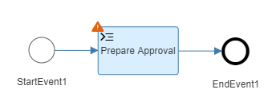
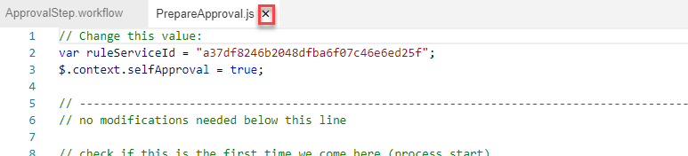

# Creating a Workflow from Scratch

## Table of Contents
- [Business Scenario](#scenario)
- [SAP Business Application Studio (BAS)](#bas)
  - [Navigate to BAS](#openBas)
  - [Create a Dev Space](#createDevSpace)
  - [Creating the project](#createProject)
- [Using Workflow Editor](#workflowEditor)
  - [Modeling Branches](#branches)
  - [Workflow Context](#context)
  - [Configuring the details](#details)
  - [Adding User Interfaces with Workflow Forms](#forms)
  - [Adding Workflow Attributes](#attributes)
- [Build and Deploy](#deploy)
- [Course Summary](#summary)

## Business Scenario 

In this exercise we create a simple, one-step approval with rework capability.

## SAP Business Application Studio (BAS) 

### Navigate to BAS 
1. Open your SAP BTP Cockpit at https://cockpit.hanatrial.ondemand.com/
1. Navigate to your subaccount
1. Select `Services / Instances and Subscriptions`
1. For the application `SAP Business Application Studio`, click on the icon to `Go To Application` 
1. Optional: set a Bookmark for quick access

> SAP Business Application Studio (BAS) is a feature-rich IDE running in your browser, and available as part of the Business Technology Platform (BTP). 

### Create a Dev Space 

1. Click on `Create Dev Space`

> If you already have a dev space, it will look like this:

> A 'Development Space' is a separate area to store all your files while using BAS. It's bound to your personal user.

> Note that Dev Spaces are not intended for safe, long-term storage of files. Use a source code management system like git for this.

1. Give your Dev Space a name, e.g. `workflow`
1. Keep the default template selection `SAP Fiori`
1. Select `Workflow Management` from the list of  additional extension
1. Click on `Create Dev Space`

1. Optional: if the status of your Dev Space is `Stopped`, click on the play button to start it
1. Wait until the Dev Space is in status `Running`
1. Click on the name of your Dev Space to open BAS

> BAS loads many components in the background upon start and may react slowly for the first 1-2 minutes.

> Dev Spaces are automatically stopped after some time of inactivity.

### Creating the  project 

1. From the welcome screen, select `Start from Template` to start the wizard
1. Select `Basic Multitarget Application`
1. Click on `Start`
1. Choose a project name, e.g. `Tutorial`
1. Click on `Finish`

> This will open the file Explorer inside the newly created project. You can open a different project from the menu with `File -> Open Workspace...` and selecting either a specific project or the parent folder `projects` itself.

1. From the menu, select `View -> Find Command...` or press `F1`

1. In the popup, type `mta` to filter the available commands, then select `Create MTA Module from Template`. 

1. Select `Workflow Module`
1. Click on `Start`
1. Keep the defaults for `mta.yaml` file path and target folder
1. Choose a name for the module, e.g. `Capex`
1. Click on `Next`

> This creates a workflow module inside the MTA and directly let's you create the first workflow inside it.

1. Enter `ApprovalStep` as name for the workflow
2. Click `Finish`

> The technical workflow definition Id, as used in Monitor Workflows and API calls, is derived from the namespace and workflow name. It needs to be unique per BTP tenant, otherwise workflow deployments would overwrite each other.

> Note: If the wizard does not work correctly for you, you can either try a different browser, or use the Yeoman commandline version:
> - Menu: `Terminal -> new Terminal`
> - type `yo`, press enter, select `Basic Multitarget Application` with cursor up/down, select with enter, enter project name `Tutorial` and confirm with enter
> - switch into that directory by typing `cd Tutorial` and press enter
> - type `yo`, press enter, select `@workflow/workflow Module` with cursor up/down, select with enter, confirm the mta path with enter, confirm the module folder with enter, enter the module name `Capex` and confirm with enter, press enter to leave the namespace blank, enter `ApprovalStep` as workflow name and press enter, press enter again to skip the description and complete the wizard
> - you can hide the terminal by clicking on the (little rectangular) `Toggle Bottom Panel` icon in the very bottom right of the screen
> - Optional: from the menu, select `File -> Open Workspace...` and select the project you just created (`Tutorial`) to only show this project in the explorer.
 

## Using Workflow Editor 

- Take a look at the elements of BAS IDE and Workflow Editor
1. Menu bar
2. File Explorer, showing project 'Tutorial' in this screenshot
3. List of open editors
4. Editor area, showing the Workflow Editor with the new workflow `ApprovalStep`
5. Inside Workflow Editor: Palette, with available Flow elements
6. Inside Workflow Editor: main edit window with graphical workflow display
7. Inside Workflow Editor: Properties pane for the currently selected Flow element (or the workflow itself). Contains a tab 'General' with the technical ID, the displayed name and an optional documentation of this element, as well as additional fields or tabs depending on the selected element type.

1. Click on the `StartEvent1` to select it
1. This opens the Speed Buttons. Select `Tasks` (rectangular icon ), then click on the `Script Task`

> Using the Speed Buttons, the new element is automatically placed directly next to the selected element, and connected to it. If another element is already connected, it is connected inbetween.

1. In the Properties pane, enter `Prepare Approval` as name.
1. Press Tab or click anywhere else to leave this field

> Note the orange warning icon, indicating that additional, mandatory configuration is missing. We will fill them in later.

1. From the palette, select `Tasks` (rectangular icon ), then `Service Task`

1. Note how when moving the mouse over the editor area, the new task sticks to the mouse pointer, ready for placement.
1. Note the yellow dotted lines which help align elements with other, close-by elements for a nicer arrangement.
1. Click on the existing Sequence Connector between `Prepare Approval` and `EndEvent1` (it will be displayed bold when hovering over it), to place the symbol 'on it'.

> Placing an element from the palette on an existing Sequence Connector will split the connector and place the new element inbetween, similar on when using the Speed Buttons.

> Inserting elements does not change the position of existing elements. When there is not enough space available, the connectors will form a loop. 

1. Click on the `ServiceTask1` to select it
1. Drag'n'Drop the service task a bit lower, by clicking and holding, dragging it with the mouse, then releasing it at the new position.

1. Select the `ServiceTask1` and name it `Get Approvers` using the properties pane.

1. In the top right corner of the editing area, use the `+` / `-` icons to change the zoom level of the workflow. Alternatively, the mouse wheel can be used.
1. Use the windrose to pan the workflow editing area. Click the middle circle to zoom and center the whole workflow into view. Alternatively, dragging with the mouse is supported: click and hold on an empty area in the editor, then drag.
1. For simple (non-branching) workflows, the automatic layouter can be helpful. Click on first `Arrange Vertically` and then `Arrange Horizontally` to see the difference.
1. Select the event (circle) named "EndEvent1", then click on the trash bin icon (or press 'delete') to remove it. Note how also the connecting arrow (called `Sequence Flow`) is removed.

1. Select `Get Approvers` and from the Speed Buttons, select `Tasks`, then `Script Task`. Note how the new task is selected and the Speed Buttons are directly available.
1. From the Speed Buttons of the `ScriptTask2`, select 'Gateways' (diamond-shaped symbol ), then `Exclusive Gateway`

> Gateways branch the flow into several outgoing connectors. The exclusive gateway indicated that exactly one branch is followed, based on a condition. We will add the second branch and condition later.

1. Select `ScriptTask2` and name it `Process Approver Details`
1. Select `ExclusiveGateway1` and name it `Approval Needed?`
1. Add a User Task: select the gateway `Approval Needed?`, from the Speed Buttons select `Tasks`, then `User Task`
1. Name it `Approval Task`
1. In the same way, add another Script Task and name it `Process Approval Result`
1. Then add a second Exclusive Gateway named `Approval Decision`
1. From the Speed Buttons of the gateway `Approval Decision`, select `Events` (circle icon ), then `Terminate End Event`
1. Name it `Terminate Approval`

> The `End Event` and `Terminating End Event` both end execution of this branch. If parallel branches are still running, the `End Event` will keep those running, while the `Terminating End Event` will stop the whole processing of this workflow. If the workflow was referenced from another workflow, execution will continue in this one.

1. Ensure your workflow looks like this:

> This is a good time to use the `Arrange Horizontally`  functionality.

### Modeling Branches 

1. From the palette, select `Tasks`, then `User Task`
1. Place the task above `ScriptTask1`.

1. Name it `Rework Approval Request `
1. From the Speed Buttons, click-and-hold on the `Sequence Flow Connector` (Arrow ) and....

1. ...drop it onto the `Prepare Approval` task.

>  Notice the small dots appearing around and in the center of the shape. Dragging a Connector on them influences the way the connector is displayed.

1. Select the second gateway, `Approval Decision`, and from the Speed Buttons, click-and-hold the `Sequence Flow Connector` and...

1. ...drop it onto the `Rework Approval Request`, on the dot on the right edge of the task.

> By default the connector is placed on the middle of an element. This leads to this S-shape of the connector.

1. Select the last placed connector by clicking on it
1. Note that both endpoints are now displayed (white circle)

1. Click-and-hold the endpoint inside the gateway `Approval Decision` and drag it upwards onto the dot at the top of the shape

> Note how the Sequence Connectors now have labels attached to them. This indicated that more than one connector leaves a Gateway and is used to name them.

1. From the palette, select `Events`, then `End Event`
1. Place the end event below the second gateway `Approval Decision`
1. Name it `End Approval Step`

1. From the Speed Buttons of the second gateway `Approval Decision`, drag a Connector downwards onto the `End Approval Step`

1. From the Speed Buttons of the first gateway `Approval Needed?`, drag a Connector downwards onto the `End Approval Step`, placing the end on the dot on the left side of the shape
1. Select this last Connector again and move the starting point to the dot at the bottom of the shape of the gateway.

1. Verify your workflow looks like this:

### Workflow Context  

> The context of a workflow is a data object which is associated with each workflow instance. It follows the form of a JSON structure and can be freely defined by the workflow modeler.

1. Select the Start Event `StartEvent1`
1. Rename it to `Start Approval Step`
1. With the Start Event still selected, open the tab `Details` from the properties pane
1. Check `Configure Sample Context`
1. Click on `Create File`

> When starting a workflow instance, an initial context is passed. Here we can define an example context, so show the expected basic structure of the context for this specific workflow. This allows for easy starting of workflows in *Manage Workflows* during development.

1. Give the filename as `CapexSampleStartPayload`
1. Click on `Create`

> This creates a new file with the given name and suffix *.json* inside your project folder.

1. Select and delete the example content of this new file, e.g. by pressing `CTRL+A` followed by `DELETE`
1. Open the provided file [CapexSampleStartPayload.json](files/CapexSampleStartPayload.json) and copy the content into the open editor window.
1. Replace the placeholder for `Name` with your name
1. Replace the placeholder for `UserId` with the technical user id on BTP, i.e. the username used for login
1. Close the file by clicking on the 

> The context can be accessed inside of Script Tasks by using the syntax `$.context.Requester.Name`. Many property fields support JUEL Expressions, for which the context can be accessed with `${context.Requester.Name}`.

### Configuring the details  

1. Click on the Script Task `Prepare Approval` to select it
1. In the properties, under the heading `Script File`, click on `Create File`
1. give the name as `PrepareApproval`
1. Click on `Create`

> This creates a new file with the given name and suffix *.js* inside your project folder.
> During runtime, the contents of this *.js* file will be executed as Javascript to work on the context.

1. Select and delete the example content of this new file, e.g. by pressing `CTRL+A` followed by `DELETE`
1. Open the provided file [PrepareApproval.js](files/PrepareApproval.js) and copy the content into the open editor window.
1. Do not make any changes to the file at this time.
1. Close the file by clicking on the 

> The `ruleServiceId` refers to a provided rule already imported during setup of this tutorial. The `selfApproval` instructs this example workflow to sent approvals to the workflow initiator instead of the actual approver as specified by the rule. In a later exercise, a custom rule to determine the approver will be created and these two lines be changed.

1. Select the Service Task `Get Approvers`
1. Select the properties tab `Details`
1. As destination, enter `BUSINESS_RULES`. This destination has been automatically created for you by the booster.
1. Keep `Others` as Service, as we are entering the service details manually.
1. As Path, enter `/rest/v2/rule-services`. This is the relative path to the [Rules API](https://api.sap.com/api/SAP_CF_BusinessRules_Runtime_V2/).
1. As HTTP Method, select `POST`
1. The path to XSRF Token can be left empty
1. For the request variable, set `${context.internal.rulesPayload}`
1. For the response variable, set `${context.internal.ruleresult}`
1. Since we are using the technical user as configured in the destination, leave the `Principal Propagation` box unchecked.

> The request variable specifies the part of the workflow context which is sent as JSON body to the remote system. The response returned is then placed in the context at the place specified by the response variable.

1. Select the Script Task `Process Approver Details`
1. In the properties, click on `Create File` and give the name `ProcessApproverDetails`
1. Replace the default content of the new file with the one of the provided file [ProcessApproverDetails.js](files/ProcessApproverDetails.js)
1. Close the file by clicking on the 

> File names and locations inside the project can be freely chosen. We recommend to keep the names similar to the flow elements they are associated with. If you later need to rename or move a file, you can re-associate it using the button `Select` and selecting it from the list.

1. Select the User Task `Approval Task`
1. Select the properties tab `Details`
1. Keep the priority as `Medium`
1. As Subject, enter `Approval for Capital Expenditure Request "${context.Title}" in your role as ${context.role}`.
1. For Recipients Users, enter `${context.internal.step.approver.UserId}`
1. For Recipients Groups, enter `${context.internal.step.approver.GroupId}`
1. For this task we do not define a `Due Date`
1. `Show in workflow log` and `Allow forward` can be kept as the defaults

> Note how JUEL expression are used to access the context inside the properties fields.

1. Select the Script Task `Process Approval Result`
1. In the properties, click on `Create File` and give the name `ProcessApprovalResult`
1. Replace the default content of the new file with the one of the provided file [ProcessApprovalResult.js](files/ProcessApprovalResult.js)
1. Close the file by clicking on the 

> Actions taken by the user in Workflow Form UIs can be accessed through `$.usertasks.usertask1.last.decision`, where `usertask1` is the technical identifier of the respective user task. See also [Access the Decision](https://help.sap.com/viewer/e157c391253b4ecd93647bf232d18a83/Cloud/en-US/9fd9395339e94143ac9ce9e693b06bd1.html) in the Help Portal.

1. Select the User Task `Rework Approval Request `
1. Select the properties tab `Details`
1. Keep the priority as `Medium`
1. As Subject, enter `Rework required for CapEx Request "${context.Title}"`.
1. For Recipients Users, enter `${context.Requester.UserId}, ${info.startedBy}`

1. Next to the Exclusive Gateway `Approval Needed?`, select the Sequence Flow connecting to the `Approval Task`
1. In the properties, give the name as `Yes`
1. As `Condition`, enter `${context.internal.step.isRequired}`

> The condition refers to a variable in the context which has been computed in the previous Script Task based on the result of the call to Rules.

1. Next to the Exclusive Gateway `Approval Needed?`, select the Sequence Flow connecting to the `End Approval Step`
1. In the properties, give the name as `No`
1. Select the checkbox `Default`

> There needs to always be exactly one default branch. This branch is taken if none of the conditions given in the other branches match (return true).

1. Next to the Exclusive Gateway `Approval Decision`, select the Sequence Flow connecting to the `End Approval Step`
1. In the properties, give the name as `Accepted`
1. As `Condition`, enter `${usertasks.usertask1.last.decision == "approve"}`
1. Select the Sequence Flow connecting to `Rework Approval Request `
1. Give the name as `Rework`
1. As `Condition`, enter `${usertasks.usertask1.last.decision == "rework"}`
1. Select the Sequence Flow connecting to `Terminate Approval`
1. Give the name as `Rejected`
1. As `Condition`, select the checkbox `Default`

1. Ensure your workflow looks like this:

### Adding User Interfaces with Workflow Forms  

> In this section we will use Workflow Forms to create a quick and simple UI.

1. Select the User Task `Approval Task`
1. Select the properties tab `User Interface`
1. Select `Form` as the type of UI
1. Click on `Create File`

1. Name the new Form `ApprovalForm`
1. Note that the ID is automatically filled in
1. Specify the `Revision` as `1.0`
1. Click on `Create`

> This creates a new file with the given name and suffix *.form* inside your project folder. Forms will be deployed alongside workflows, but are independently revisioned.

1. In the Form editor, click on `Add Section` 
2. Enter a section name of `Investment Details` 
3. Click on `Add Field`
4. Enter a field label of `Title`
5. Note that you can also enter or change the label of the field in the properties pane.
6. Keep the type of the field as `String`
7. Specify the context path as `${context.Title}`
8. Change the mode to `Display Only`
9. Add another field named `Request Id`, type `String`, Context Path `${context.RequestId}` and `Display Only`
10. Add another field named `Type`, type `String`, Context Path `${context.Investment.Type}` and with mode `Editable`.
11. Select the `Required` constraint for this field

> Note how the ID is automatically derived from the label if not given explicitely.
> `Add Section` and `Add Field` depend on your current selection, which is shown as a slight blue background.

1. In the same way, add all of those fields:

Label | Type | Context Path | Editable | Required
-|-|-|-|-
Title | String | `${context.Title}` | no | 
Request Id | String | `${context.RequestId}` | no | 
Type | String | `${context.Investment.Type}` | yes | yes
Country/Region | String | `${context.Investment.Country}` | yes | yes
Business Unit | String | `${context.Investment.BusinessUnit}` | yes | yes
Description | String | `${context.Investment.Description}` | yes | no
CAPEX | Float | `${context.Investment.CAPEX}` | yes | yes
OPEX | Float | `${context.Investment.OPEX}` | yes | yes
Total Cost | Float | `${context.Investment.TotalCost}` | yes | yes
ROI | Float | `${context.Investment.ROI}` | yes | no
Currency | String | `${context.Investment.Currency}` | yes | yes

1. Select the section `Investment Details` by clicking on it
1. Click on `Add Section` and give it a title of `Investment Requester`
1. In this section, add the following fields `Name` and `Comment from Requester`
1. For the `Comment from Requester` field, specify `Text Area` as `Control`, with a `Medium` height

Label | Type | Context Path | Editable | Required
-|-|-|-|-
Name | String | `${context.Requester.Name}` | no | 
Comment from Requester | String | `${context.Requester.Comment}` | yes | no

1. Select the section `Investment Requester` and click on `Add Section`. Do not enter a title (empty field), but specify `history_` as ID in the Properties pane.
1. Click on `Add Collection`
1. Set the title to `History`
1. Set the Context Path to `${context.History}`

> This defines a tables with the rows coming from an array object specified in the Context Path. Fields below the collection section can refer to the row using the expression `${item.xxx}`

1. Select the collection `History` and click `Add Field` and add the following fields:

Label | Type | Context Path | Editable | Required
-|-|-|-|-
User | String | `${item.User}` | no | 
Role | String | `${item.Role}` | no | 
Decision | String | `${item.Decision}` | no | 
Comment | String | `${item.Comment}` | no | 

1. Select the section `Investment Requester` and click on `Add Section`. Do not enter a title (empty field), but specify `decision` as ID in the Properties pane.
1. Add a single field:

Label | Type | Context Path | Editable | Required | Control
-|-|-|-|-|-
Comment | String | `${context.comment}` | yes | no | Text Area (large)

1. Verify that your Form definition looks like this:

> Note that you can re-arrange the ordering of fields by using drag'n'drop

1. Select the tab `Decisions`
1. Click `Add`
1. Enter `Text`, `ID` and `Type` of these three decisions:

Text | ID | Type
-|-|-
Approve | `approve` | Positive
Reject | `reject` | Negative
Rework | `rework` | Neutral

> `Text` specifies the label displayed to the user, whereas `ID` is the technical value returned from `$.usertasks.usertask1.last.decision` which is then used for string comparisons. The `Type` indicates different graphic styles / colors.

1. Close the Workflow Form editor by clicking on the 

1. Select the User Task `Approval Task` and note how the `ID` and `Revision` has been automatically filled in

1. Select the User Task `Rework Approval Request `
1. Select the properties tab `User Interface`
1. Select `Form` as the type of UI
1. Click on `Select` to choose an already existing Form 
1. Using the dropdown, select the form `ApprovalForm.form` which we've just created.
1. Click on `OK`

> Re-using the same form is a simplification for this exercise. In a real project the displayed fields and whether they are editable would differ between the approver and the reworking requester.

1. Ensure that there are no warning signs  showed in your workflow anymore.

> If there are warning signs left, hover over them to view a description what is missing:

### Adding Workflow Attributes (optional) 

> The Business Key is used to correlate workflow instances for orchestration across systems. Workflow attributes are used to measure key indicators for visualization in Workflow Visibility.

> This tutorial will use process attributes defined in the next exercise, and not use the ones defined on single workflow level. Adding those here is an optional learning opportunity. You may skip this step.

1. Click on an empty area on the Workflow Editor to clear any active selection
1. In the Properties pane, enter the `Busineyy Key` as `${context.RequestId}`
1. Change both the `Subject` and the `Description` to `Approval Step` (with a space)

1. Select the properties tab `Attributes`
1. Optional: Drag the dividing bar between the main edit window and the Property pane to the left, to get enough space for entering the Attributes.
1. Click on `Add`
1. Enter the following Attributes:

ID | Label | Type | Value
-|-|-|-
RequestId | RequestId | String | `${context.RequestId}`
Title | Title | String | `${context.Title}`
Type | Type | String | `${context.Investment.Type}`
TotalCost | TotalCost | String | `${context.Investment.TotalCost}`
CAPEX | CAPEX | String | `${context.Investment.CAPEX}`
OPEX | OPEX | String | `${context.Investment.OPEX}`
ROI | ROI | String | `${context.Investment.ROI}`
Currency | Currency | String | `${context.Investment.Currency}`
approvalStatus | approvalStatus | String | `${context.internal.approvalStatus}`

> Note: you can select an attribute row and use `Move Up` / `Move Down` buttons to change the ordering. Or you can add the attributes in reverse.

## Build and Deploy 

> Multi-Target Application projects in Business Application Studio are build (assembled) into *.mtar* files, which can then be deployed to the Cloud Foundry environment.

1. From the menu, select `View -> Find Command...` or press `F1`
1. In the popup, type `mta` to filter the available commands, then select `Build MTA Project`. 

1. Optional: if you have multiple projects open in BAS, select the `Tutorial/mta.yaml` in the popup when asked for selecting the project descriptor file.

> Alternatively, in the File Explorer you can right-click the *mta.yaml* file and choose `Build MTA Project`

1. A console window will open in the bottom panel, showing the progress of the build.
1. Verify that there are no error messages.

> This will create a folder `mta_archives` with the file `Tutorial_0.0.1.mtar` inside. The name and version is taken from the *mta.yaml* description.

1. From the menu, select `View -> Find Command...` or press `F1`
1. In the popup, type `mta` to filter the available commands, then select `Deploy MTA Archive`. 

1. Optional: if you have multiple projects open in BAS, select the `Tutorial_0.0.1.mtar` in the popup when asked for selecting the MTA Archive.

> Alternatively, in the File Explorer you can open the folder `mta_archives` and right-click the `Tutorial_0.0.1.mtar` file and choose `Deploy MTA Archive`

> For deployment, login to the Cloud Foundry backend is required. Depending on your setup, this might be a different user than the one using BAS. For the Trial account it is the same.

1. Follow the wizard to login to Cloud Foundry:
1. Confirm the API which specifies your region, e.g. `https://api.cf.us10.hana.ondemand.com` for the American Trial account
1. Enter your Email address used for your account
1. Enter your password. If you have Two-Factor-Authentication (2FA) enabled for your account, append the TotP token. 
1. Select the account you wish to deploy into, e.g. the one ending in *trial*
1. Select the Cloud Foundry space to deploy into, e.g. `dev`
1. A console window will open in the bottom panel, showing the progress of the deployment.
1. Verify that there are no error messages. Note that there might be modeling errors which are only detected during deployment.
1. Optional: you can close the Bottom Panel with the icon  in the lower right of the screen.

# Course Summary 
* You can now create an MTA Workflow project in SAP Business Application Studio
* You have learned how to use the Workflow editor to place flow elements, move them around and connect them
* You understand the Workflow Context
* You can model flow decisions using Exclusive Gateways and different branches
* You can make REST calls to external systems
* You can specify User Tasks, and implement a simple UI using Workflow Forms
* You learned how to build and deploy the workflow to the Cloud Foundry environment
