# Executing and monitoring your workflows 

## Table of Contents
- [Overview of Workflow tiles in Fiori Launchpad](#flp)
- [Working with workflows as a process administrator](#mwa)
  - [Starting a Workflow](#startWorkflow)
  - [Monitoring a Workflow instance](#monitorWorkflow)
- [Participating in a Workflow](#MyInbox)
- [Course Summary](#summary)

## Overview of Workflow tiles in Fiori Launchpad 

1. Open your SAP BTP Cockpit at https://cockpit.hanatrial.ondemand.com/
1. Navigate to your subaccount
1. Select `Services / Instances and Subscriptions`
1. For the application `Workflow Management`, click on the icon `Go To Application` 
1. Optional: set a Bookmark for quick access

1. In the Fiori Launchpad, find the tiles which we will be using in this exercise:
* My Inbox
* Monitor Workflows - Definitions
* Monitor Workflows - Instances

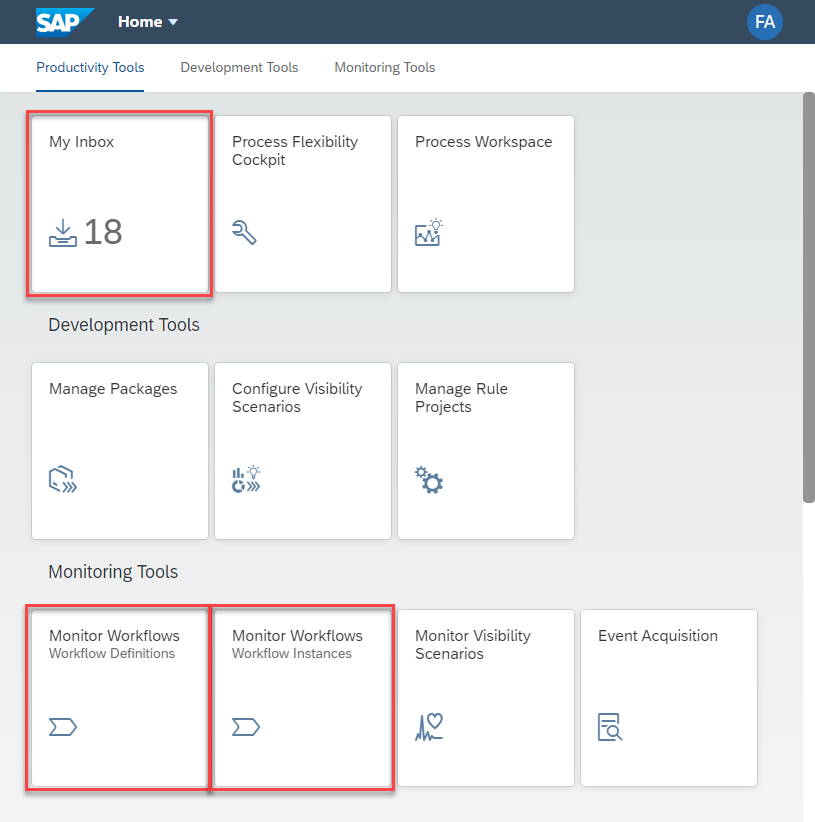

> You can have multiple browser tabs open for working in different apps at the same time.

> Clicking on "back" multiple times, or clicking on the SAP Logo in the header row, brings you back to the tile overview.

## Working with workflows as a process administrator 

### Starting a Workflow 

1. Open the `Monitor Workflows - Definitions` app by clicking on the respective tile in the Fiori Launchpad.
1. In the list of deployed Workflow definitions, select the `ApprovalStep`
1. Note that the ID is the one we've given when creating the workflow.
1. Note the version, which is automatically incremented with each deployment.

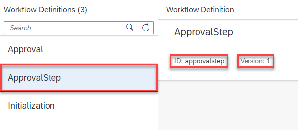

> There might be multiple definitions with the same name. In this case compare the ID, which is unique.

> The other two workflows (`Initialization` and `Approval`) were deployed as part of the sample Capex process imported in exercise 1.

1. Click on `Start New Instance`

1. Note how the popup shows an editable text area for the start context, and that it is pre-filled with the sample start context as defined during modeling.
1. Click on `Start New Instance`

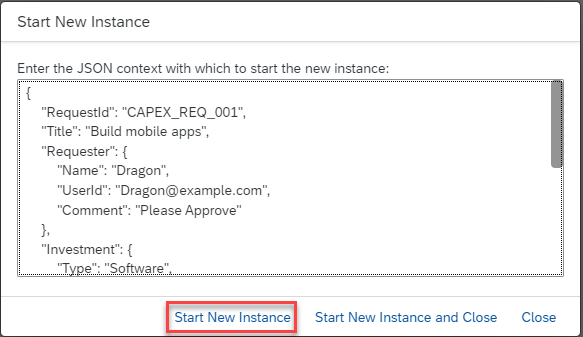

> This keeps the popup open, ready to start another workflow.

1. Note the popup indicating the workflow has been successfully started.

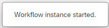

> This way of starting a workflow is mainly used for testing by a developer or administrator. Workflows can be started by end users using a Start Form or a custom UI5 application, or by other systems using the Workflow API.

1. In the still open popup, change the value of the field `TotalCost` from 15000 to 5 (five)
1. Click on `Start New Instance and Close` to start a second workflow.

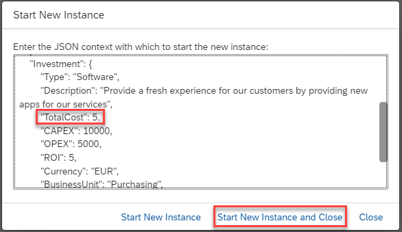

> The workflow is configured to not need approval for such a small total cost and will thus be completed directly, with no manual approvers needed.

1. Click on `Show Instances`

> This switches to the `Monitor Workflows - Instances` app and sets a display filter for the workflow definition. This is the quickest way to find instances of a specific workflow definition.

### Monitoring a Workflow instance 

1. Note how the list of Workflow instances shows one running instance

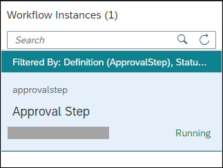

> Note that filtering is active: by *Definition* because we opened it from the MWA Definitions view, and based on *Status* as per default only active instances are shown.

1. At the bottom of the list, click on the filter icon 

1. Select `Status`
1. Add `Completed` to the selected Status filtering
1. Click on `OK`

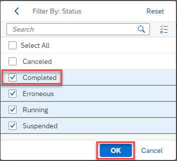

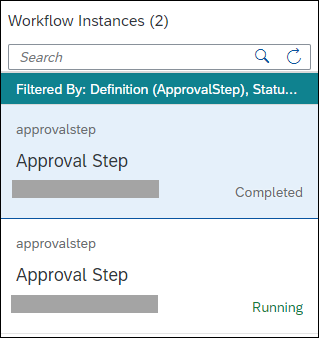

> This shows all instances of the filtered-on definition `ApprovalStep`. The one with low total cost was auto-approved and completed immediately, while the other one is waiting for user action.

1. Look at the detail view of the workflow instance and find these information:
  - the workflow definition ID and version for this instance
  - the user and time when this instance has been started
  - the current workflow context
1. Click on `Execution Log` and see all the steps already executed in this workflow instance.

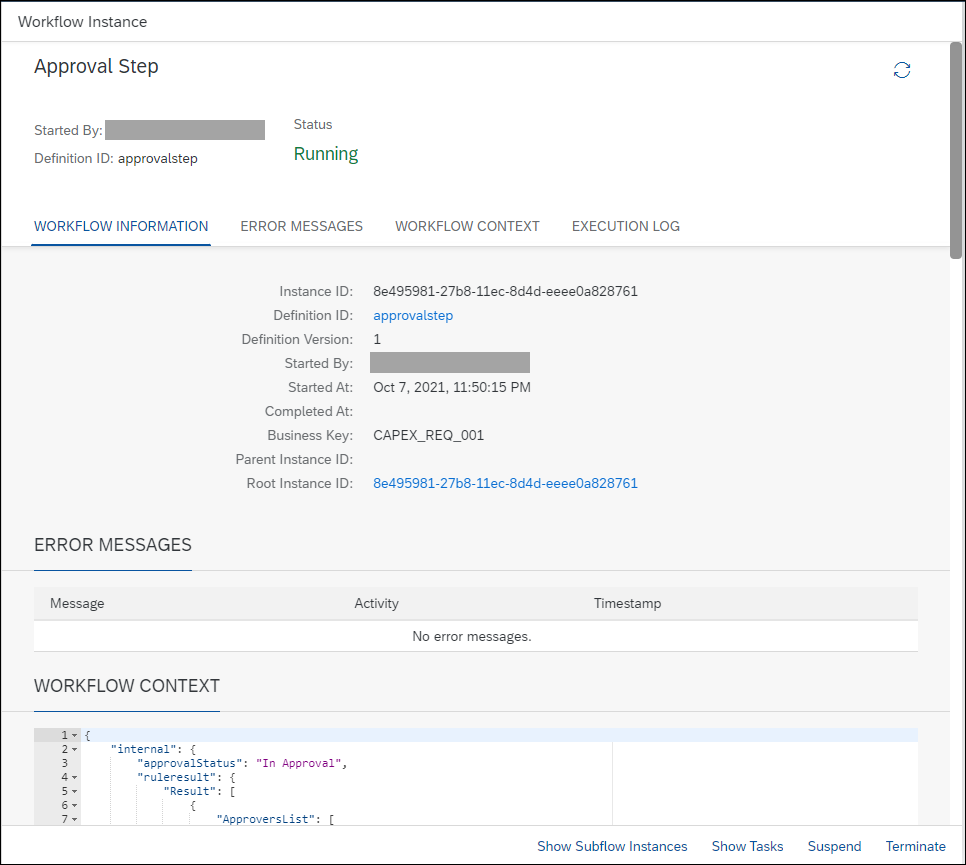

## Participating in a Workflow 

1. Navigate back to the Fiori Launchpad, by clicking Back  several times, or by directly clicking on the SAP logo 
1. Click on the tile for `My Inbox` to open it

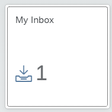

> Note how it display the number of tasks available for you already in the tile overview.

1. Ensure that the task for *Approval for Capital Expenditure Request "Build mobile apps" in your role as LocalManager* is selected.

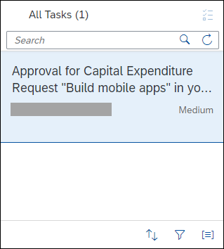

1. Scroll down to the field `Comment` and write `rework needed`
1. Click on `Rework`

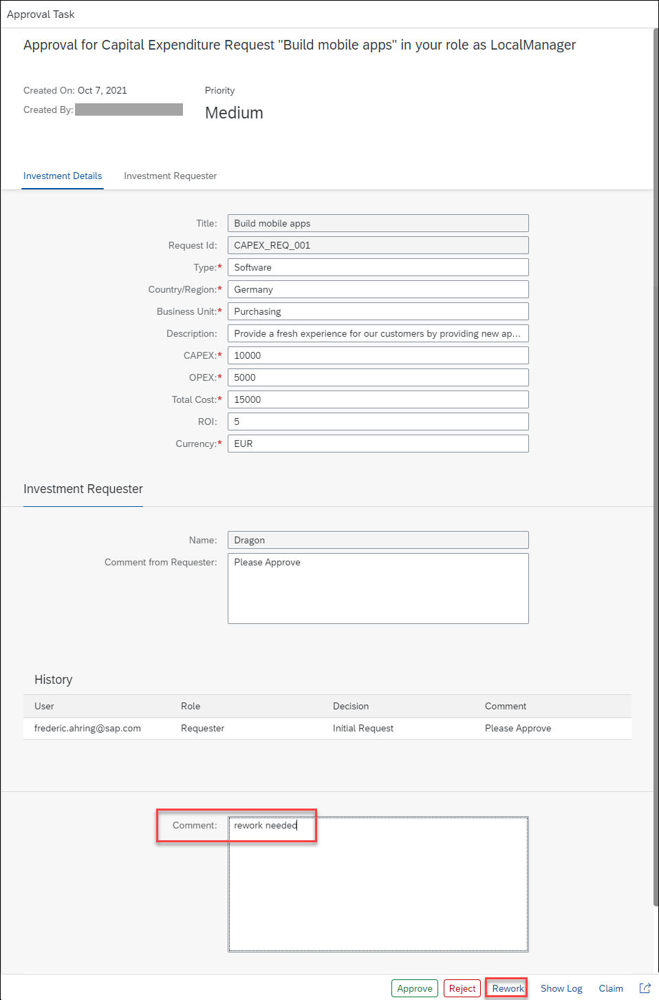

1. In the Task list, click on the Refresh Icon 
1. Ensure that the task *Rework required for CapEx Request "Build mobile apps"* is shown and selected.

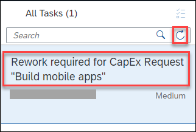

1. Enter `unchanged, as discussed` in the `Comment` field
1. Click on `Approve`

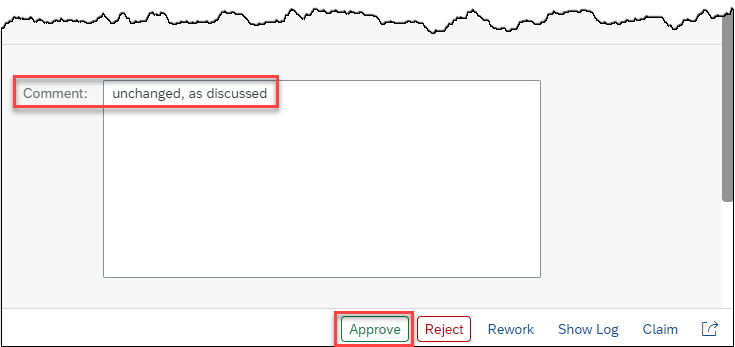

> Remember: to keep things simple, we have re-used the same form for the Approval and the Rework task in this exercise.

1. In the Task list, click on the Refresh Icon 
1. Ensure that the task *Approval for Capital Expenditure Request "Build mobile apps" in your role as LocalManager* is shown and selected.
1. Click on `Approve`

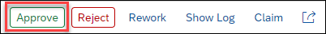

# Course Summary 
* You can now start a workflow from MWA
* You can Monitor both running and completed workflows
* You can now open Tasks in My Inbox as process participant

