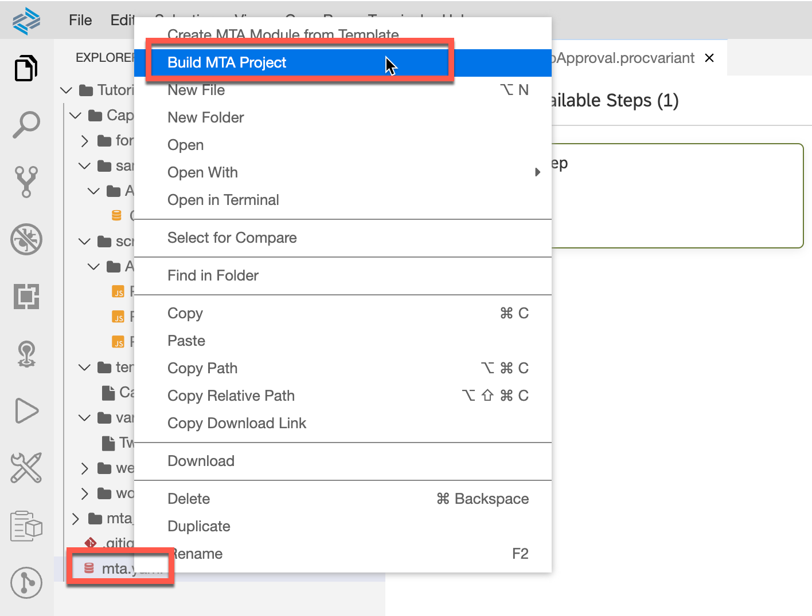

# Creating a Process Template

## Prerequisite

You have created a workflow as explained in the exercise in week 1, unit 4 which will be the basis of the process template.

## Table of Contents
- [1. Open SAP Business Application Studio](#section1)
- [2. Create a new process template](#section2)
- [3. Configure some general data for process steps](#section3)
- [4. Configure the process context](#section4)
- [5. Create a default process variant](#section5)
- [6. Build and deploy](#section6)
- [7. Summary](#section7)

## 1. Open SAP Business Application Studio 
1. Open your SAP BTP Cockpit at https://cockpit.hanatrial.ondemand.com/

1. Click `Go to Your Trial Account`.

1. Navigate to your subaccount.

1. Select `Services / Instances and Subscriptions`.

1. For the application `SAP Business Application Studio`, click on the icon to `Go To Application` 

1. Optional: set a Bookmark for quick access.

1. Optional: in case your Dev Space is not up and running, select the `Play` button to start it.

1. Once it is up and running, open your Dev Space and click the name of your name space (e.g. `workflow`).

## 2. Create a new process template 
1. From the menu select `View -> Find Command`.

1. In the pop up menu enter **template** and select `Process: Create New Template`.

1. Select your workflow module.

1. Enter the name of the process template, e.g. **CapexApproval** and press enter.

1. The skeleton of the new process template is now ready for further configurations.

>You can leave everything as is. In this case we will also go for principal propagation.

## 3. Configure some general data for process steps 
1. Select the tab `Process Steps` to start the configuration.

1. Select the `pencil` button to add a new process step.

1. In the pop-up window mark the `ApprovalStep` and click `Select`.

1. Select `Search` to search for a proper icon for the Approval Step.

1. Select `accept` and click `OK`.

1. Select the color palette to change the color of the icon from blue to green.

1. Select `Color 2: Custom` (green).

1. In the field `Minimum Occurence` enter **1**. Leave the field `Maximum Occurence` as it is.

1. Within `Step Attribtues` add now the `Step Properties`.

1. Maintain the following information:

| Attribute|  Value |
|---|---|
|ID|approvalstep|
|Label|approvalstep|
|Default Value|LocalManager|
|Documentation|Step to approve|
|Multi Value|No|
|Target Context|${context.approvalstep}|

## 4. Configure the process context 
>For the process context you would find the needed data e.g. in the payload file.

### Maintain process context for data mapping
1. Select the tab `Process Context`.

1. Select the `+` button to add new process context data.

1. Maintain **${context.RequestId}**.

1. Maintain further context data as listed here:
- ${context.Title}
- ${context.Investment}
- ${context.Requester}
- ${context.History}
- ${context.internal}

### Maintain process context for process attributes
1. Now add further process context data for the process attributes (to be used later in a process visibility dashboard). Click `+` button.

1. Maintain the following data:

| ID |  Label | Type | Value |
|---|---|---|---|
|RequestId|RequestId|string|${context.RequestId}|
|Title|Title|string|${context.Title}|
|Type|Type|string|${context.Investment.Type}|
|Country|Country|string|${context.Investment.Country}|
|ROI|ROI|string|${context.Investment.ROI}|
|CAPEX|CAPEX|string|${context.Investment.CAPEX}|
|OPEX|OPEX|string|${context.Investment.OPEX}|
|TotalCost|TotalCost|string|${context.Investment.TotalCost}|
|Currency|Currency|string|${context.Investment.Currency}|
|approvalStatus|approvalStatus|string|${context.internal.approvalStatus}|

We have finalized all the entries for the process context for the new template.

1. Save your work.  

## 5. Create a default process variant 
>Based on the new template we will now create a default variant. This variant can then be used to configure the respective process variant by the business process expert in the Flexibility Cockpit.

1. Select `View -> Find Command`.

1. Search for **variant** and select `Process: Create New Variant`.

1. Select your workflow module.  

1. Select the process template you have created before.

1. Finally provide a name for the variant, e.g. **TwoStepApproval**.

1. The modeling canvas is empty and the new process variant can be designed.

1. Drag and drop the `ApprovalStep` between the start and end event to add this step to the process variant.

1. Change the name to **Group Head Approval**.

1. Repeat these steps to add a second process step called **Local Manager Approval**.

1. Save your work.  

## 6. Build and deploy 
>As the last step, we will now build and deploy our newly created template.
1. In the repository select the YAML file `mta.yaml`.

1. Open the context menu with a right-click and select `Build MTA Project`.  

1. Now move to the `mta_archives`above and select the mtar file, e.g. `Tutorial_0.0.1.mtar`.  
1. Again open the context menu with a right-click and select `Deploy MTA Archive`.  

1. Enter your Cloud Foundry endpoint.  

1. Enter the e-mail address you have used within SAP BTP.  

1. Enter your SAP BTP password.  

1. Select the organization.  

1. Select the space `dev`.  

1. Once the deployment has been successful, the MTA Archive is ready.  

***
## 7. Summary 

Congratulations, you have now created your first process template, including a process variant. Once it has been included in a package and made available, this will be the basis for any configuration in the Process Flexibility Cockpit. This you will learn in upcoming units.
