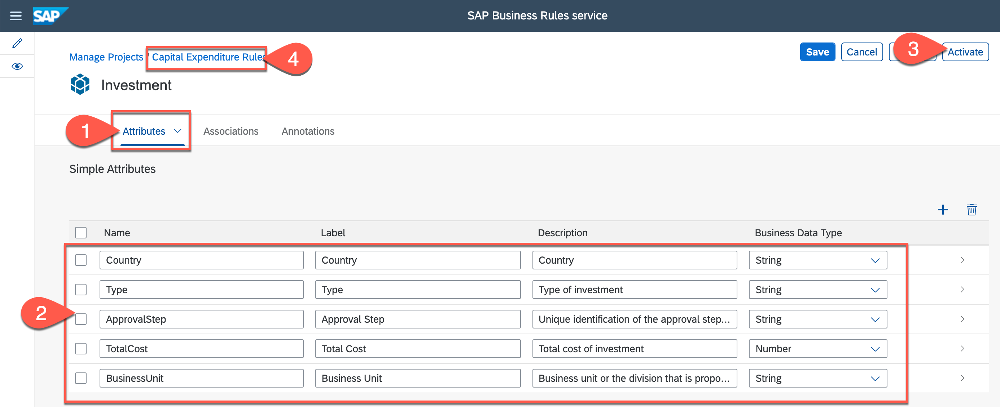
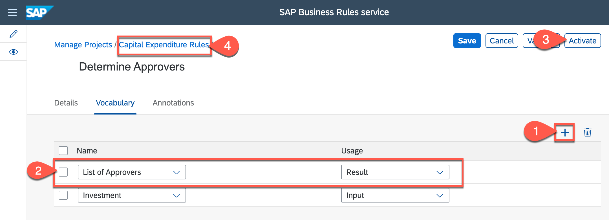

# Unit 3 - Developing Business Rules

## Table of Contents
- [Author, Activate and Deploy Business Rules](#section1)
    - [Overview](#section1-overview)
    - [Create Project](#section1-createproject)
    - [Create Data Object](#section1-dataobject)
    - [Configure Value Help in Data Object](#section1-valuehelp)
    - [Create Rule Service](#section1-ruleservice)
    - [Create Decision Table Rule](#section1-dt)
    - [Import Decision Table from Microsoft Excel](#section1-importdt)
    - [Create Ruleset](#section1-ruleset)
    - [Deploy Rule Service](#section1-deploy)
    - [Create Version](#section1-version)
 - [Test Business Rule](#section2)
    - [Overview](#section2-overview)
    - [Discover Business Rules API](#section2-discover)
    - [Configure Test Environment](#section2-testenv)
    - [Invoke Business Rules](#section2-runrule)
 - [Integrate Business Rule with Workflow](#section3)
    - [Overview](#section3-overview)
    - [Modify, Build and Deploy Workflow](#section3-wfdeploy)
    - [Execute and Monitor Workflow](#section3-wfexecute)
 - [Summary](#summary)
   


## Author, Activate and Deploy Business Rules <a name="section1"></a>
### Overview <a name="section1-overview"></a>

The exercise is based on authoring and managing rules for capital expenditure, using SAP Business Rules service. The rule determines the approvers based on investment details.

  
  
In this exercise, you will learn about different enterprise rule models and how to author them using Manage Rules Application. You will create, configure and activate these business rules models, and learn how to deploy the rule service to cloud for consumption. 

  
  
  
### Create Project <a name="section1-createproject"></a>

1. Open *Workflow Management Launchpad* and click to open **Manage Rule Projects**.
    - Login with trial username and passwords <p>
    
    
  
2. Click **+** to create a new business rules project.

    

3. In the *New Project* screen, do the following:
    - Enter **CAPEX_00** in the **Name** box.
    - Enter **Capital Expenditure Rules** in the **Label** box.
    - Enter **Business rules to determine approvers for new investments in capital expenditure process** in **Description** box.
    - Select **2.0** as the **Expression Language**.
    - Click **Save** 
    <p>
     

#### Your business rules project is created with the needed configurations. 

### Create Data Objects <a name="section1-dataobject"></a>

1.	Click **Data Objects** tab
    <p>
     
  
2.	Click **+** in *Local Data Objects* section to create data object
    <p>
     

3. In the *New Data Object* screen, do the following:
    - Enter **Investment** in the **Name** box.
    - Enter **Investment** in the **Label** box.
    - Enter **Details of the investment** in the **Description** box.
    - Click **Attributes** tab.
    
    <p>
     
    
4. In *Simple Attributes* section of *Attributes* tab, do the following:
    - Click **+** to create attribute.
    - Enter **Type** in the **Name** box.
    - Enter **Type** in the **Label** box.
    - Enter **Type of investment** in the **Description** box.
    
    <p>
     
    
 5. Repeat the step 4 above to create more data object attributes with following details: 
    
    | Name | Label | Description | Type |
    |---|---|---| --- |
    | ApprovalStep | Approval Step | Unique identification of the approval step. Ex, LocalManager, VicePresident | String |
    | Country | Country | Country | String |  
    | TotalCost | Total Cost | Total cost of investment  | Number | 
    | BusinessUnit | Business Unit | Business unit or the division that is proposing the investment  | String | 
    
    <p>
     
    
    - Click **Activate**
    - Click **Capital Expenditure Rules** to navigate back to the *Data Objects* page

6. In the *Data Objects* screen, click **+** in *Local Data Objects* section to create another data object
    <p>
     

7. In the *New Data Object* screen, do the following:
    - Enter **Approvers** in the **Name** box.
    - Enter **Approvers** in the **Label** box.
    - Enter **Detail of investment approvers** in the **Description** box.
    - Click **Attributes** tab.
    <p>
     
    
8. In *Simple Attributes* section of *Attributes* tab, create new attributes by clicking **+** and enter the following:

   | Name | Label | Description | Type |
    |---|---|---| --- |
    | UserId | User ID | User ID of the approver | String |
    | GroupId | User Group  | User group who can approve the step in workflow | String |  
    | Email | Email  | Email address of the approver(s)  | String | 
    
    <p>
     
    
    - Click **Activate**
    - Click **Capital Expenditure Rules** to navigate back to the *Data Objects* page
    
9. In the *Data Objects* screen, click **+** in *Local Data Objects* section to create another table data object
    <p>
     
    
10. In the *New Data Object* screen, do the following:
    - Enter **ApproversList** in the **Name** box.
    - Enter **List of Approvers** in the **Label** box.
    - Enter **List of approvers required for a given approval step.** in the **Description** box.
    - Select **Table** as **Type**.
    - Select **Approvers** as **Reference Data Object**.
    
    <p>
     
    
    
    - Click **Activate**
    - Click **Capital Expenditure Rules** to navigate back to the *Data Objects* page


##### You have created and configured data objects in business rules project. Investment data object will be used as Input and Approver data object will be used as Output in the rule service. These data object & their attributes will be used while modelling rule expressions.

<p>
     

### Configure Value Help in Data Object <a name="section1-valuehelp"></a>

1. Click to open **Investment** data object.
<p>
     

2. In the *Investment* data object screen, do the following:
    - Click **Attributes** tab.
    - Click to open **Type** attribute.
<p>
     

4. In *Type* attribute screen, click **Edit** button.
<p>
     

5. Click **Value Help** tab, and do the following:
    - Click **+** to add a value help to this attribute.
    - Select **Value List** from the **Type**
    - Click to on the **Value List** row to navigate into the value help.
    <p>
    
  
    > Note: there are two kinds of value help (a) Static and (b) Dynamic. Dynamic value help can be created with Service URL Mapping and Static can be created with Value List type. In dynamic value you can connect any backend system and make a service call. In this exercise, you will create static value help where you will manually create value-description pair.
 
  
6. In the *Value List* screen, do the following:
    - Click **+** to add static value to value list.
    - Enter **Software** in **Value** and **Description** box.
    - Repeat the steps to add few more values:
    
      | Value | Description | 
      |---|---|
      | Machinery | Machinery |
      | Building | Building |
      | Equipment | Equipment | 
      | Service | Service |

    <p>
     
    
    - Click **Save** 
    - Click on **Investment** to navigate back to the respective data object.
    
 7. In the *Investment* data object, 
    - click **Edit** 
    <p>
     
  
    - click **Activate**
    - click **Capital Expenditure Rules** to navigate back to the *Data Objects* page.

    <p>
     


### Create Rule Service <a name="section1-ruleservice"></a>

1. Click **Rule Services** tab.
    - Click **+** to add new rule service.
    
    <p>
     

2. In the *New rule service* screen, do the following:
    - Enter **DetermineApprovers** in **Name** box.
    - Enter **Determine Approvers** in **Label** box.
    - Enter **Rule service to determine approvers for new investment** in **Description** box.
    - Click **Vobaculary** tab. 
    
     <p>
     
 
 3. In the *Vocabulary* section, do the following:
     - Click **+** to add vocabulary to rule service.
     - Select **Investment** under **Name** column.
     - Select **Input** from **Usage** column.
     
      <p>
     
  
     - Repeat the steps again to do the following: 
        - click **+** another to add vocabulary to rule service.
        - select **List of Approvers** as **Name** and **Result** as **Usage**
        - click **Activate**
        - click **Capital Expenditure Rules** to navigate back to the *Rule Services* page.
     
          <p>
         
     
 ##### You have created and configured Rule Service which will be finally deployed once we have configured all the rule entity models.
 
 <p>
         

### Create Decision Table Rule <a name="section1-dt"></a>

1. Click **Rules** tab.
    - Click **+** to add new rule.
    <p>
         

2. In the popup, do the following:
    - Enter **DetermineApproversRule** in **Name** box.
    - Select **Decision Table** as **Type**.
    - Click **Create**
    
    <p>
         
    
3. In the *New Rule* screen, do the following:
    - Enter **Determine Approvers Rule** in **Label** box.
    - Enter **Determine approvers for an approval step of the sample capital expenditure approval process.** in **Description** box.
    - Click **Decision Table** tab.
    
    <p>
         
  
4. Click **Settings** to configure condition and result columns of the decision table rule.
    <p>
         

5. In *Decision Table Settings* popup, do the following:

    > Note: As you start typing in the Condition Expression box, you will get in-place context help with the list of Vocabulary, Operators and Functions. 
       
    - Click **All Match** as **Hit Policy**
    - In **Condition Expressions** input value, do the following:
        - From the in-place context sensitive help options, select **Investment >> Type**
      
      <p>
         
  
      <p>
         

   - In **Fixed Operator** drop down, click **= is equal** operator.
        > When you add an operator to the condition colummn then that operator is fixed for all the rows of the column. For Example, if you use "=" operator then all you need to add is values to the rows while the operator is inherihently taken as "=". If you want to have different operators like EXISTSIN, GREATER THAN etc, while defining the condition columns, keep the *Fixed Operator* empty. 
      
      <p>
         

   - Click **+** to add new condition expression.
   - Repeat the steps above to add few more condition expressions as following: 

      | Condition Expression | Fixed Operator | 
      |---|---|
      | Investment.Country | = |
      | Investment.Business Unit | = |
      | Investment.Approval Step | = |
      | Investment.Total Cost | <no operator> |

      <p>
         

   - Click list-option to select **Result** data object (see step 9 in above image).

   - Double-click on **List of Approvers**.
      <p>
         

   > Note: You will notice *Access* column as the result properties. When you set access as *Hidden*, the respective column will not be seen during rule modelling or modifying decision table. 


   - Click **Apply** to configure the decision table with selected condition and result columns.
   
      <p>
         

5. In the newly created *Decision Table*, do the following to add values to condition and result columns:
    
    -  For **Investment.Type** (first column) you will choose the value from the value help defined for this attribute.
        -  click on the input text box. 
        
            <p>
         
  
        -  press **Ctrl+ Space** or press any key.
        -  expand **Fixed Value** and click list-view to select value help.
        
           <p>
         
  
        -  from the value help pop-up, select **Software**.
        
            <p>
         
  
        -  click **Enter** key to confirm or click anywhere outside the input field. 
        
            <p>
         

     - Click on the input field of **Investment.Country** column (second column of the decision table) and enter **'Germany'**
    
          > Note: For all *String* type of data object attribute, you have to mandatory add single-quote (') before and after the text.

          > After you have finished typing, press Enter key to confirm or click outside the input field. 

          <p>
             
    
    - Similarly, enter the following valued for next two columns:
     
        | Condition Column | Value | 
      |---|---|
      | Investment.Business Unit | 'Purchasing' |
      | Investment.Approval Step | 'LocalManager' |
      
       <p>
         
     
     - For **Investment.Total Cost** column (fifth condition column of the decision table), enter **<= 15000**
        -  click **Enter** key to confirm or click anywhere outside the input field. 
        
        <p>
         
        
     - Similarly, enter the following expressions for the respective result column (or **Then** section):
      
        | Result Column | Expression | 
        |---|---|
        | User ID | 'your trial user ID' |
        | Email | 'your trial user email' |
        | User Group | 'LocalManager' |
        
        - Click **Save**
      
        <p>
         

##### You have created a decision table-based rule with condition and result columns. You have added a row to the decision table and used in-place context sensitive help to add expressions to the cell values. Now, in next chapter you will use Microsoft Excel to import the data in the decision table.

 <p>
         

### Import Decision Table Data From Microsoft Excel <a name="section1-importdt"></a>

1. Download the **DetermineApproversRule** excel in your [local folder from same GitHub location](https://github.com/SAP-samples/btp-workflow-management-opensap/tree/main/Week%202/Unit%204/files). 


2. You will have to update the **Project ID** and **Rule ID** in the excelsheet. For this, you have to go back to the **Manage Rule Projects** application and get these IDs as follows:

    - From **Manage Rule Projects** application, click **Manage Projects** link.
    
    <p>
         
    
    - Click **Settings** to add new display column to get the ID of the project.
    
     <p>
         

    - Click the **ID** checkbox to select the ID column.
      - Click **Ok** 
      
       <p>
         
      
    - Copy the ID of the rules project by pressing **Ctrl+C** or **Command+C**. 
      - Paste this ID in the notepad of your system.
      - Click **>** in the row to open rules project. 
    
     <p>
         
    
    - Click **Rules** tab.
    - Click **Settings** to add new display column to get the ID of the rule.
    
     <p>
         

    - Click the **ID** checkbox to select the ID column.
      - Click **Ok** 
      
       <p>
         
      
    - Copy the ID of the decision table rule by pressing **Ctrl+C** or **Command+C**. 
      - Paste this ID in the notepad of your system.
      
       <p>
         
      

2. Open the excel and update **Project Name**, **Project ID** and **Rule ID** in the available excel sheet as shown in steps below:

    - Update **Project Name** with your rules project name like *CAPEX_00*
    - Update the **Project Id** with the rules project ID copied above. 
    - Update the **Rule Id** with the decision table ID copied above. 
    
     <p>
         
    
    > Note: ensure that there are no leading or trailing spaces while you do the copy paste. 
    
    - Change the **UserId** and **Email** of the first row (line number 6) to your trial user ID and name respectively.
    
     <p>
         
    
    - Save the excelsheet
    

3. Click to navigate into the decision table rule. 

 <p>
         

4. Click **Import**

 <p>
         

5. In the import popup, do the following:
    - Click **Browse...** and select the excel sheet updated in steps above.
    - Click **Import** 
    
     <p>
         

6. You will have the rows imported in your decision table. Check if the result column values of the first row of the decision table have your *trial user id*
    - Click **Edit**
    
     <p>
         
    
    - Click **Activate**
    - Click **Capital Expenditure Rules** to navigate back to the *Rules* page.

     <p>
         

### Create Ruleset <a name="section1-ruleset"></a>

1. Click **Rulesets** tab.
2. Click **+** to create ruleset.

<p>
    
  
3. In the *New ruleset** screen, do the following:
    - Enter **DetermineApproversRuleset** in **Name** box.
    - Enter **Determine Approvers Ruleset** in **Label** box.
    - Enter **Ruleset that contain rules needed for determining approvers for the new investments** in **Description** box.
    - Select **DetermineApprovers** as **Rule Service**.
    - Click **Rules** tab. 
    
    
    <p>
         


4. In the *Rules* section, do the following:
    - Click **Add Rule**.
    - Click **Insert First**.
    
    <p>
         
  
    - In the new row that gets added, 
      - Click **Determine Approvers Rule** from the combo-box in **Name** column. 
      - Click **Activate**.
      - Click **Capital Expenditure Rules** to navigate back to the *Rules* page.
    
    <p>
      
    

##### You have created the ruleset, associated it with rule service and added the rule. Ruleset is a collection of rules of similar output.

<p>
         

### Activate Rule Project <a name="section1-activate"></a>

> Before you deploy the rule service, all the rule entity models like Project, Data Objects, Rulesets, Rules and Rule Services have to be in activated state. Go through all the models to ensure that they are activated.

1. Click **Details** tab, and then click **Edit**

<p>
    

2. Click **Activate** to activate the project.

<p>
    

3. Click **Data Objects** tab, and check if all the data objects are in **Active** state.

<p>
    

4. Click **Rule Services** tab, and check if all the rule services are in **Active** state.

<p>
    

5. Click **Rulesets** tab, and check if all the rulesets are in **Active** state.

<p>
    

6 Click **Rules** tab, and check if all the rules are in **Active** state.

<p>
    


### Deploy Rule Service <a name="section1-deploy"></a>

1. Click **Rule Services** tab.
2. Click **Deploy** for the rule service you want to deploy.

<p>
    

3. From the *Deploy system* pop-up, click **Cloud Runtime** option.

<p>
    

4. After the ruleset is deployed successfully, you will see the successful message. The rule service can now be consumed via the Business Rules RESTful APIs. 

<p>
    

### Create Version <a name="section1-version"></a>

> You can create version of the rules project only if all the entities of the project is in *Active* state. 

1. Click on **Details** tab.
2. Click **Release Version** to create a new version of the rules project.

<p>
    

3. In the *Release Version* popup, do the following:
    - Enter **Version** as **1.0.0**.
    - Enter **Revision** as **Trial**.
    - Enter **Description** as **Basic capex approval rules for new investment requests**.
    - Click **Release**.
    
    <p>
    

4. To view the version created, navigate back to main page by clicking on **Manage Projects** link.
5. Click the checkbox of the business rules project for which you created the version.
    - Click **History**. 

    <p>
    

6. You will see all the versions of the rule projects available here. To deploy the versioned rule, click to navigate into *Version 1.0.0*.

<p>
    

7. Click **Rule Services** tab and then click **Deploy**.

<p>
    
  
8. From the *Deploy system* pop-up, click **Cloud Runtime** option.
9. After the rule service is deployed successfully, you will see the message. 
    - Now, the rule service can be consumed via the Business Rules REST APIs. 
      > There are two business rules Runtime APIs to consume the rules. One for versioned rules */v2/rule-services* and another one for working-set */v2/workingset-rule-services*
      
##### You have created the versioned rule project and deployed the versioned rule service in Cloud Runtime.
      
## Testing Business Rules <a name="section2"></a>

### Overview <a name="section2-overview"></a>

Now you will learn the basics of testing business rules invocation from APIs available in SAP API Business Hub. During the course of this exercise, you will do the following: 
  - Discover Business Rules API in SAP API Business Hub
  - Configure Cloud Foundry Test Environment
  - Invoke Business Rules


### Discover Business Rules API <a name="section2-discover"></a>

1. Open **SAP API Business Hub** using this URL: https://api.sap.com
2. Click **Login**.

    <p>
     

3. Enter your I/D/S or P user ID to login to API Business Hub.
4. In **Search** box, enter **business rules** and press **Enter** key to search.

    <p>
      

5. Click **SAP Business Rules Service** API Package to open all available business rules APIs.

   <p>
      

6. From available APIs, click **Rule Execution API for Cloud Foundry** *Version V2* to open rule execution APIs.
   
   > Business Rules have two set of APIs: Authoring and Execution. Execution APIs are used when you want to run the rules from any application using APIs and  Authoring APIs are used to design rule using APIs. You will also notice two set of versions v1 and v2. Version v1 is currently deprecated and will soon be unsupported.
    
      <p>
          
    

7. Click **API Reference** and then click to open **Invoke Rule Service** APIs. 
    - Click **Try Out** to test the rules.

   <p>
        


### Configure Test Environment <a name="section2-testenv"></a>

1. Click **Select Environment**, and then select **Add New Environment**. 

    <p>
       

2. To configure the environment you need auhtorization details. All the information is available in business rules service instance key. To get the needed information, do the following: 
    - Login to your trial account and navigate into your sub-account.
    - From left panel, click **Instances and Subscriptions**.
    - Select **Business Rules** from the drop-down, 
    - Click on **wm_businessrules** instance to view the service keys. 
    
    <p>
      
    
    - From available service keys, click **...** on any service key and then select **View**.
    
      <p>
      


4. From the **Credentials** popup, do the following:
    - Click the **Form** tab.
    - Copy the values of the following properties in your system notepad:
        - rule_runtime_url
        - clientid
        - clientsecret, 
        - url (this is token url)
        
        |  | | 
        |---|---|
        
        
    - Click **Close**.
     
    > These will be used to configure the testing environment in API Business Hub. 


5. Enter the respective details in the **Configure New Environment** properties as copied from the business rules service key in previous step:

    | Test Property | Value | 
    |---|---|
    | Display Name | Trial |
    | Runtimeurl | as copied above as *rule_runtime_url* |
    | Authentication Type | OAuth 2.0 |
    | Client ID | as copied above as *clientid* |
    | Client Secret | as copied above as *clientsecret* |
    | Tokenurl | as copied above *url* |

    > Note: Before copying, remove *https://* from the **token url** and **runtime url** as shown in the image. 
    For Example: If the URL is  *https://db73ff38trial.authentication.eu10.hana.ondemand.com*. Then token URL will be: *db73ff38trial.authentication.eu10.hana.ondemand.com*
    
    |  |  | 
    |---|---|
    
    - Click checkbox for **Apply this environment to all APIs**.
    - Select option of **Save this environment for future sessions**.
    - Click **Configure**
    

    
### Invoke Business Rules <a name="section2-runrule"></a>

> ##### There are two kinds of runtime APIs: 
>   - The first one is for versioned invocation which means if you have deployed any version of the rule service and want to invoke it.
>   - The second one is for the working set invocation which means that you do not have any version but have deployed the working set directly.
    
1. Once the environment is selected, do the following:
    - select down-arrow button to wrap the *Deploy/Undeploy Rule Service* options.
    - click down-arrow key to expand **Invoke Rule Service** options. 
    - click **/v2/workingset-rule-services** from left panel. 
    - click **Body** tab. 
    
        <p>
            
    
    - Copy and paste this json string:
        
        > Be careful during copying. Sometimes during copy and paste, the spaces are added automatically. In that case the payload will be considered as invalid and execution will fail. Remove the spaces.
      
    ```json
           {  "RuleServiceId": "ba2229ca79874fe381ced8a4ee6dad21",
              "Vocabulary": [
                  {
                      "Investment": {
                          "Country": "Germany",
                          "Type": "Software",
                          "TotalCost": 15000,
                          "ApprovalStep" : "LocalManager",
                          "BusinessUnit" : "Purchasing"
                      }
                  }
              ]
          }
    ```
        
      <p>
          
            
     - Replace the **RuleServiceId** with rule service id of your rules project.
        - To get the rule service ID, do the following:
           - In **Manage Rule Projects** application, click **Rule Services** tab.
           - Select **Settings**.
           
           


           - In the *Settings* dialog, select **ID** column and click **OK**.

              <p>
                

           - Copy the **Rule Service ID** and replace it with *RuleServiceId* in the API Body. 

                <p>
                
            
           
    
      - Click **Run**. 
      
         <p>
            

      
      - You will see the response after the successful rule execution. 
           <p>
            
      
        - Try and change the **TotalCost** to **25000** and **ApprovalStep** to **CFO** in the *Request* body, and you will see a different response. 
          
          |  |   | 
          |---|---|
       
          

## Integrate Business Rules with Workflow <a name="section3"></a>
### Overview <a name="section3-overview"></a>

Business Rules in SAP Workflow Management enables business users & application developers to automate their decisions and enhance their decision-making experience. Integration and consumption are the key. There are 4 consumption patterns that you can use to leverage the power of business rules capabilities in your applications/solutions.


Pattern 2 talk about how business rules can be used to abstract the decision logic in process orchestration scenarios. Workflow and Business Rules work harmoniously to provide an unmatched support to automate decisions in workflow such that the business users can easily modify the rules without changing the process flow. **Business rule service can be accessed in Workflow using a Service Task**. 


    
In this section, you will integrate the versioned *approver determination rules* with the capex approval workflow. For that you will configure the **Service Task** with the details of the **Business Rules API**. 

### Modify, Build and Deploy Workflow <a name="section3-wfdeploy"></a>

1. To get the Rule ID of the versioned business rules, do the following:

    - Open **Manage Rule Projects** application.
    - Click the checkbox of your business rule project and click on **History**.
    
         <p>
            
    
    - Click to navigate into the version 1.0.0.
    
         <p>
            
    
    - Click **Rule Services** tab.
    - Select **Settings**.
    
         <p>
            
    
2. In the *Settings* dialog, do the following:
    - Select **ID** column which will display the ID of the rule service. 
    - Select **OK**.
    
     <p>
        

3. Copy the **Rule Service ID** and paste in your system notepad. 
   
    <p>
       

> Now we will use the copied rule service information to configure the workflow. 

4. Open **Business Application Studio**, and click to enter you **dev space** that you have used to create the workflow

5. In your workspace, do the following:
    - Expand the workflow project.
    - Click to open the workflow.
    - Select **Prepare Approval** script task. 
    
    <p>
       
    
6. In *PrepareApproval.js* editor, paste the **Rule Service ID** as value of **ruleServiceId** variable in line 2.
    - Change the value of **$.context.selfApproval** to **false** (in line number 3) 
    
    <p>
       
    
7. From folders in the right, click to open *ProcessApprovalDetails.js* and do the following:
    - Change the value of **$.context.internal.step.isRequired** to **true** (in line number 1) 
    - Comment out line number 8 using **//** 
    
    <p>
       

8. Scroll down in the javascript file and notice how the input payload is constructed to call the business rules API in the workflow script task. 
    - **Save** and **close** the file.
    
       
       |  |  |
       |---|---|

9. Click the workflow editor again and select **Retrieve Approval Steps** service task. 

    > Notice the service task properties:
    >   - BUSINESS_RULES destination is created when you ran the Booster. This destination contains the credentials to run business rules invocation API.  
    >	- Path is the relative path of the versioned API
    >	- Request variable is the input payload as constructed in the script task before.
    >   - Response variable is where the output of the rules will be appended. 


10. Do the following to build the workflow:
    - right-click on **mta.yaml** to open the context menu.
    - click **Build MTA**.
    
    <p>
       
    
    > Ensure that the Build MTA task completes successfully.
    > - Once the build is successful, you will find the **<project-ID>_<version>.mtar** file will be created inside mta_archives.
    >       
    
11. Do the following to deploy:
    - right-click on the *mtar* file and click **Deploy MTA Archive**.
      <p>
         
    
    - If you are not logged-in then you will get the wizard to enter cloud foundry endpoint, trial email and password, organisation and space. 
    
        <p>
         
       
       > You can get the needed information about the Login URL, organization name and space name from you trial account. 
       >    


> Your deployment console should look similar to this with the **Process finished** in the second-to-last line, indicating success. If there are any errors then fix the error, build and deploy the workflow project again.


### Execute and Monitor Workflow <a name="section3-wfexecute"></a>

1. Open the **Workflow Management Launchpad** Home Page.
    - Login with your trial username and password.
    - Click **Monitor Workflows - Workflow Definitions** tile.
    
    <p>
       
 
 2. In **Monitor Workflow** screen, click the workflow.
    - Click **Start New Instance**.
    
    > Note: Monitor Workflows application has Master-Detail layout where you see all the workflows deployed on left. Ensure that you select the workflow you just deployed. 
    
    <p>
       
    
    
3. In the *Start New Instance* popup, modify the following in the JSON to any string:
    - **RequestId**.
    - **Requester**
        - **Name** can be anything.
        - **UserId** is your trial user email

    - Click **Start New Instance and Close**.
    
    <p>
       

4. A popup confirms that the workflow instance has been started.
    - Select **Show Instances** to switch to the **Monitor Workflows - Workflow Instances** application where you can view all the running, completed, suspended workflow instances and their details
    
    <p>
       

5. Select the latest created workflow instance and click on **Refresh** button on top-right corner.
    - From the **EXECUTION LOG**, you will notice that the service task **Retrieve Approval Steps** is completed successfully which executes the business rules service. 

    <p>
       
 
 6. You can also switch to **WORFKLOW CONTEXT** tab and see the output of the rule execution collected inside approvalStepResult element. 

     <p>
       

##### You have modified the workflow with your business rule service and ran the workflow to see the output with business rules execution.


## SUMMARY <a name="summary"></a>
 
#### You have completed the business rules exercise. Congratulations!
 
  You are now able to:
  - [x] Create & Activate Project, Data Object, Ruleservice, Ruleset and Rules.
  - [x] Configure Value Help in Data Object.
  - [x] Use Microsoft Excel Import/Export functionality in Decision Table.
  - [x] Deploy Ruleservice in Cloud Runtime.
  - [x] Discover Business Rules API in SAP API Business Hub.
  - [x] Configure Test Environment for Cloud Foundry.
  - [x] Execute Business Rules Execution API.
  - [x] Integrate Business Rules with Workflow.
  

...
