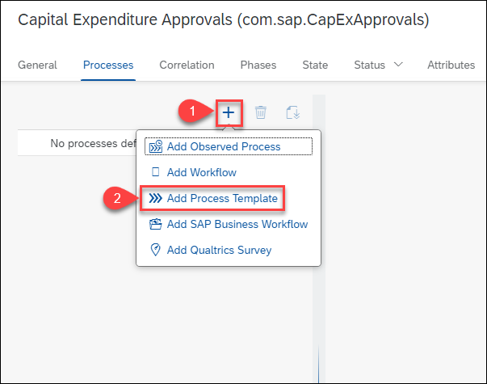
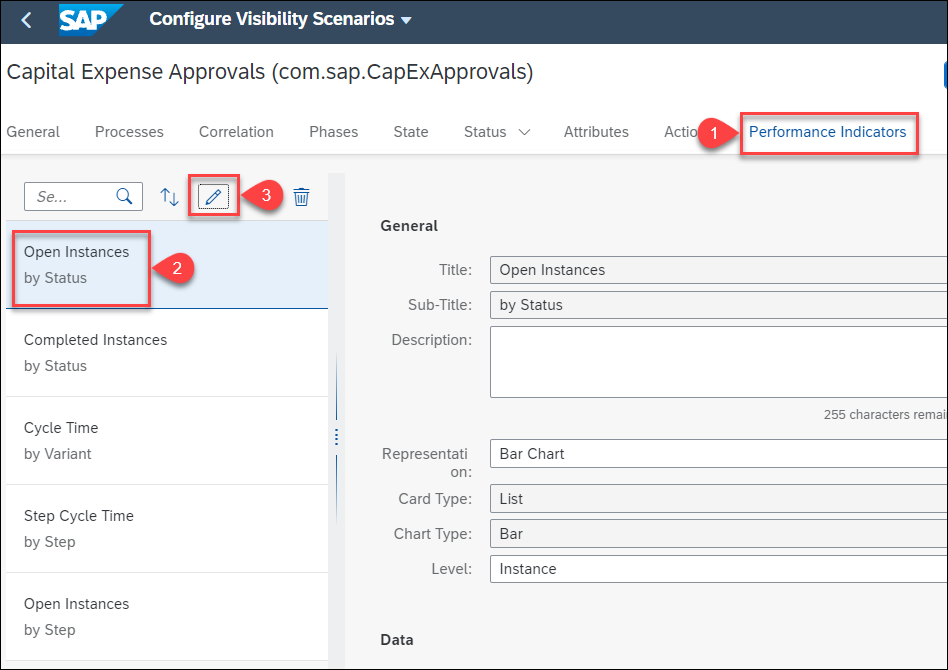
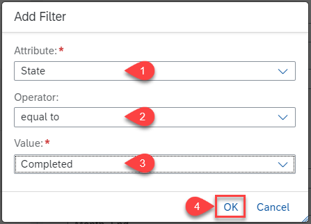
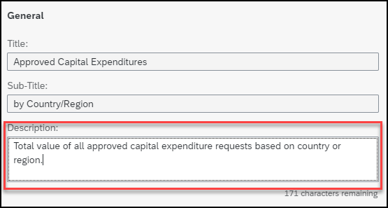

# Building a Process Visibility Scenario End-to-End

## Table of Contents
- [Overview](#overview)
- [Objective](#objective)
 - [Exercise Description](#description)
- [Access the Fiori Launchpad for SAP Workflow Management](#access)
- [Create a Visibility Scenario](#createscenario)
- [Add Process Participant](#processparticipant)
- [Modify Context](#context)
- [Change Instances and Instance Labels](#instances)
- [Configuring a Threshold](#threshold)
- [Creating Custom Attributes](#customattributes)
- [Modify autoconfigured Process Performance Indicators](#performanceindicators)
- [Create Process Performance Indicators](#createppi)
- [Adding Actions](#actions)
- [Activating the Visibility Scenario](#activate)
- [Monitoring the Visibility Scenario](#monitor)
- [Gain Visibility Using Process Workspace](#processworkspace)

## Overview 
In this exercise, you will configure a ***Visibility Scenario*** to gain insights on the process template created for ***Capital Expenditure Approvals*** by using the **Process Visibility Capability** within **SAP Workflow Management**. As a pre-requisite ensure that you have completed the prior exercises that guide you to create the process template for Capital Expenditure Approvals
## Objective 
In this exercise you will learn the following.
1.	Configure a business scenario by importing the process template modeled using SAP Business Application Studio
1.	Configure performance indicators that help gain visibility on your end to end process
1.	View events that have been acquired by process visibility service
1.	Process acquired events
1.	Access process workspace to track end to end process

### Exercise Description 

You will do the following as part of the exercises:
1.	Create a new **business scenario** and add the **Process Template** as a **process participant**.
1.	Enhance the business scenario with **calculated attributes**
1.	Create **process performance indicators** that help you track the end to end process.
1.	Use **Event Acquisition** app to view the acquired events
1.  Use **Monitor Scenarios** application to view and schedule processing of events for the activated scenarios.
1.	Access **Process Visibility Workspace** to track and gain visibility on your end to end process

## Access the Fiori Launchpad for SAP Workflow Management 
1. Access your trial account

	https://account.hanatrial.ondemand.com/trial
	
	- Login with trial username and password
1. Navigate to your subaccount
1. In your subaccount, do the following
	- Select `Services` > `Service Marketplace`
	- Search for **"workflow management"**
	- Select the three dots on the tile to access the drop down menu
	- Click on `Go to Application`

	

**RESULT:** You now should see the Workflow Management Fiori Launchpad

## Create a Visibility Scenario 

**Prerequisite**: You’re assigned to the **PVDeveloper** role.

1. In the **Workflow Management Fiori Launchpad** click on `Configure Visibility Scenario` **tile**.

	
	

1.	Click + to create a new scenario

    

1.	In the New Scenario wizard, do the following:
	- Enter ***com.sap*** in the `Namespace` box.
	- Enter ***Capital Expenditure Approvals*** in the `Name` box.
	- Replace ***Capital_Expenditure_Approvals*** in the `ID` to ***CapExApprovals***
	
	  > This is to adhere to the length constraints
	  
	- Enter ***Insights into Capital Expenditures Approvals*** in `Description` box.
	- Click `Create`
	
		
	
**RESULT:** You will now see your newly created visibility scenario in draft state

4. Select the visibility scenario to perform further configurations

	

## Add Process Participant

1. Click on the `+` button 
1. Select `Add Process Template`

	

3. Select the Process Template you created

	

**RESULT:** The process template, its context and all its events are added to your scenario

## Modify Context

### Change Data Type

You can modify the context to suit technical and business requirements.
In this case, the following context data needs to be modified such that their `Data Types` are changed from ***String*** to ***Double***

	- CAPEX
	- OPEX
	- ROI
	- TotalCost
1. Select the context `CAPEX` and click on the ***pencil*** icon to edit it

	

1. Choose `Data Type` drop down and select `Double`

	

**RESULT:** The data type of `CAPEX` will now be `Double` 

*Repeat the same for the rest of the Variables mentioned in the list*

**RESULT:** All the variables listed above are now of type `Double`

### Rename Context
You can rename the context to suit business requirements. In this case, we rename the following context data 

	- Country
	- approvalStatus

1. Select the context `Country` and click on the ***pencil*** icon to edit it

	
	
1. Change ***"Country"*** in `Name` field to ***"Country/Region"*** and click `OK`

	
	
1. Similarly, change ***"approvalStep"*** to ***"Status of the Approval Workflow"***
	
	
	
**RESULT:** The names of the above context attributes are changed appropriately

## Change Instances and Instance Labels

The ***Instances Label*** and ***Instance Label*** are used to represent the process instances in the **Process Workspace**. 
> Instances label represents a group of instances in the Process Workspace. 

> Instance label represents an instance in the Process Workspace. 

In our exercise, we are working with **Capital Expenditure *Requests***. So let's change our ***Instances Label*** and ***Instance Label*** accordingly.

1. Click on `General`
1. Type in **Requests** in the `Instance Labels` field
1. Type in **Request** in the `Instance Label` field
1. Click on `Save`

	

You will notice this in your **Process Workspace** when you view the process instances table, and when you drill down into one of the process instances.

## Configuring a Threshold

The scenario target defines the expected time by when a scenario instance must be completed. The status depicts how a scenario instance is progressing based on the scenario target or the defined custom sub-statuses.

> In the course of this exercise, feel free to set your Targets based on minutes or hours so you can see it in effect. However, in a productive scenario, this obviously would be based on realistic business tagets.

1. Click on `Status`
1. Select the `Target Type` drop down

	
1. From the dropdown select `Constant`

	
1. The default threshold is set to **6 days**, with the substatus changing from `On Track` to `At Risk` if **4 days** have elapsed i.e. **80%** of the threshold, and to `Critical` if **6 days** or more have elapsed since the process instance started

	
1. You can change the `Target Value` to **10 minutes**, and the `Threshold` to **50%**. In doing so, you will be able to see your process instance enter `At Risk` sub-state when **5 minutes** have elapsed, and subsequently `Critical` status when **10 minutes** (or more) have elapsed.

	
	
## Creating Custom Attributes

A business scenario will create a set of **Attributes** based on the _context of the **Process Participants**_. Additionally, attributes based on *certain aggregations and conditions* can be created. 
The Attributes are used to either display more information, or act as a **Measure for Performance Indicators**

1. Click on `Attributes`

		
1. Click on `+` 
1. Select `Add Calculated Attribute`

	
1. Provide the following information in the pop-up
	- In the `Name` field provide **Month_Start**
	- In the `ID`, it should be autofilled with the same name **Month_Start**
	- In `Expression Type` dropdown, select **Month of Attribute**
	- In `Attribute` dropdown, select **Start Time**
	- Select `OK` once done
	
		
	
**RESULT:** The newly created attribute will be listed under `Calculated` section in the `Attributes`

*Similarly, let's create the following calculated attributes*
	- Month_End
	- Year
	- Quarter
	- Week
	
*Repeat the steps above. The changes will be in the `Expression Type` and `Attribute` as follows*

Name | Expression Type | Attribute
------------ | ------------- | -------
Month_End| Month of Attribute |End Time
Year| Year of Attribute |Start Time
Quarter| Quarter of Attribute |Start Time
Week| Week of Attribute |Start Time

**RESULT:** The newly created attribute will be listed under `Calculated` section in the `Attributes`

## Modify autoconfigured Process Performance Indicators
Performance indicators represent aggregated information of a measure, grouped by dimensions, and applied filters. A group of performance indicators gives the business users a holistic view of the process and enables them to understand process performance at a glance.

> You will see that there already are preconfigured Process Performance Indicators.

> These are autogenerated based on the process participants, and provide valuable information out of the box

Let's now alter the autogenerated **Performance Indicators** to better suit our scenario. Remember, we are dealing with ***Capital Expenditure Requests***; we shall subsequently rename the autoconfigured **performance indicators** to reflect that

1. Click on `Performance Indicators`
1. Select `Open Instances`
1. Click on the **pencil** icon

	
1. Provide the following information in the pop-up
	- In the `Title`, replace **Open Instances** with **Pending CAPEX Approvals**
	- Click on `OK`
	
		
1. Similarly, change the **Titles** for the following **performance indicators**

	Performance Indicator | Old Title | New Title
	------------ | ------------- | -------
	Completed Instances by Status| Completed Instances | Completed CAPEX Approvals
	Cycle Time by Variant| Cycle Time | CAPEX Approval Cycle Time
	Step Cycle Time by Step| Step Cycle Time | CAPEX Approval Cycle Time
	Open Instances by Step| Open Instances | Pending CAPEX Approvals
1. Click on `Save`

**RESULT:** The following Process Performance Indicators will be appropriately renamed.

> At this point, you have a **Visibility Scenario** that provides insights on your business process. You can click on `Activate` and activate the scenario. Every new ***capital expense approval process*** event will now be *consumed and correlated* by the **Visibility Scenario** and the ***insights*** will be available in **Process Workspace**

> However, this might not capture everything that a **Business Process Expert** or relevant ***persona*** would desire as ***insights to the business process***. In the next steps, we'll further enhance the **Visibility Scenario** with new **performance indicators**.

## Create Process Performance Indicators

### Value of Capital Expenditure with Approval Overdue

1. Click on the `+` button
	
	
1. Provide the following information in the pop-up
	- In the `Title` field, provide **Value of Capital Expenditure**
	- In the `Sub-Title` field, provide **with Approval Overdue**
	- The `ID` field will be auto populated
	- Click `OK`
	
		
1. Select the newly created **performance indicator**

	
	- Under the `General` section, enter **"Total investment value of all approval requests currently in critical status."** in the `Description`
	
		
	- Under the `Data` section, select the dropdown for `Measure`
	- Select `TotalCost` as the measure
		
				
	- Under the `Filters` section, click on `+` 
		
		
	- In the pop-up provide the following information
		- Select **Status** from the `Attribute` dropdown
		- Select **equal to** from the `Operator` dropdown
		- Select **Critical** from the `Value` dropdown
		- Click on `OK`
		
			
			
### Approved Capital Expenditure by Month

1. Click on the `+` button
1. Provide the following information in the pop-up
	- In the `Title` field, provide **Approved Capital Expenditure**
	- In the `Sub-Title` field, provide **by Month**
	- The `ID` field will be auto populated
	- Click `OK`
	
		
1. Select the newly created **performance indicator**

	
	- Under the `General` section, enter **"Total investment value of all capital expenditure requests approved in a month."** in the `Description`
	
		
	- Select the dropdown for `Representation` and select `Column Chart`
	
		
	- Under the `Data` section, select the dropdown for `Measure`
	- Select `TotalCost` as the measure
		
		
	- Select **Month_End** as the `Dimension` from its dropdown
	
		
	- Under the `Filters` section, click on `+` 
		
		
	- In the pop-up provide the following information
		- Select **State** from the `Attribute` dropdown
		- Select **equal to** from the `Operator` dropdown
		- Select **Completed** from the `Value` dropdown
		- Click on `OK`
		
			
	- Click on `+` again to add another filter
		- Select **Status of the Approval Workflow** from the `Attribute` dropdown
		- Select **equal to** from the `Operator` dropdown
		- ***Type*** **Approved** in the `Value` Field
			> Note, you are using the context value from the process participant. 
		- Click on `OK`
		
			

### Capital Expenditures by Status

1. Click on the `+` button
1. Provide the following information in the pop-up
	- In the `Title` field, provide **Capital Expenditures**
	- In the `Sub-Title` field, provide **by Status**
	- The `ID` field will be auto populated
	- Click `OK`
	
		
1. Select the newly created **performance indicator**

	
	- Under the `General` section, enter **"All in-progress capital expenditure approval requests based on approval status."** in the `Description`
	
		
	- Select the dropdown for `Representation` and select `Column Chart`
	
		
	- Under the `Data` section, select the dropdown for `Measure`
	- Select `CAPEX` as the measure
		
		
	- Select **Status of the Approval Workflow** as the `Dimension` from its dropdown
	
		
	- Under the `Filters` section, click on `+` 
		
		
	- In the pop-up provide the following information
		- Select **Status of the Approval Workflow** from the `Attribute` dropdown
		- Select **not equal to** from the `Operator` dropdown
		- ***Type*** **Restarted** in the `Value` Field
			> Note, you are using the context value from the process participant.
		- Click on `OK`
		
			

### Approved Capital Expenditure by Country/Region

1. Click on the `+` button
1. Provide the following information in the pop-up
	- In the `Title` field, provide **Capital Expenditures**
	- In the `Sub-Title` field, provide **by Country/Region**
	- In the `ID`, provide **"Approved_Capital_Expenditures_CR"**
		> Note, you are changing the ID since one of the previous performance indicators will already have **"Approved_Capital_Expenditures"** as its ID. IDs need to be unique.
	- Click `OK`
	
		
1. Select the newly created **performance indicator**

	
	- Under the `General` section, enter **"Total value of all approved capital expenditure requests based on country or region"** in the `Description`
	
		
	- Select the dropdown for `Representation` and select `Donut Chart`
	
		
	- Under the `Data` section, select the dropdown for `Measure`
	- Select `CAPEX` as the measure
		
		
	- Select **Country/Region** as the `Dimension` from its dropdown
	
		
	- Under the `Filters` section, click on `+` 
		
		
	- In the pop-up provide the following information
		- Select **Status of the Approval Workflow** from the `Attribute` dropdown
		- Select **equal to** from the `Operator` dropdown
		- ***Type*** **Approved** in the `Value` Field
			> Note, you are using the context value from the process participant.
		- Click on `OK`
		
			
			
## Adding Actions [Optional]
Actions help business users to act on situations in a process. Actions are defined at the **visibility scenario level**, and are therefore **available for all instances** of the visibility scenario **provided the configured conditions are satisfied**.

You can define two types of action: 
- **Navigational:**  Navigational actions are defined when you want to navigate to an application and perform the action.
- **Trigger Workflow:** Trigger Workflow actions are defined when you want to initiate a Workflow to respond to certain situations.
	
### Navigational Actions [Simple+Optional]
Let's configure a very simple navigational action that allows you to navigate to a desired site when the process instance satisfies some conditions

1. Click on `Actions`
1. Click on the `+` button
	
	
1. Provide the following information in the pop-up
	- In the `Name` field, type **"Navigate"** 
	- The `ID` will be autofilled
	- Click `OK`
	
		
1. Select the newly created **Action**
	
	
	- In the `General Properties` section, choose **Navigational** as the `Type`
	- Choose any of the sentiments (**Neutral/Positive/Negative**) in the `Sentiment` field.
		> Each sentiment defines its own visual appearance that matches its semantics. Example, an *Approval* would be **Positive**, *Rejection* would be **Negative**, and a *Claim* would be **Neutral**
		
		
	- In the `Navigation Link` section, provide your desired site URL, for example *"https://help.sap.com/viewer/62fd39fa3eae4046b23dba285e84bfd4/Cloud/en-US/33270a7471b840c6803d3b4227c70863.html"*, in the `Path` field
		> In a productive environment, the navigational URL would point to a relevant business specific ***Application URL***, such as a **Sales Order in S/4** etc. You can also inject attributes into the URL, such as a **Sales Order ID**, provided that it is part of the visibility scenario context.
	- Depending on whether you wish to open the URL in the same window or not, toggle the `In-Place Navigation` button to **ON** or **OFF**. In this example, we can set leave it as **OFF** 
	
		
	
	> The navigational URL can be configured using **Destinations** (see [Navigational Action](https://help.sap.com/viewer/62fd39fa3eae4046b23dba285e84bfd4/Cloud/en-US/33270a7471b840c6803d3b4227c70863.html)). 
	
	- In the `Conditions` section, click on `+`
		
		
	- Choose the following options for the conditions	
		- Select **SubStatus** from the `Attribute` dropdown
		- Select **equal to** from the `Operator` dropdown
		- Select **Overdue** from the `Value` dropdown
			> If you followed the steps above to set a **Threshold** for the process instance, the **navigational link** will appear for process instances that have not been approved within **10 minutes**
		
			
1. Click on `Save`

	
	
	
### Trigger Workflow [Advanced+Optional]
Workflow Actions can be of ***two kinds***
- **User:** You can choose trigger type as User if you want business users to take actions to handle escalations. For more information, see User Triggered Action.

- **System:** You can choose trigger type as System when you want actions to be triggered during scenario processing without need of manual intervention. For more information, see System Triggered Action.

Refer to the following workflow content package to learn and incorporate workflow actions into this visibility scenario - [Insight To Action Workflows](https://api.sap.com/package/com.sap.content.insighttoactionworkflows/overview)

The package contains workflows to notify relevant personas when some conditions are satisfied, and also restart any existing workflows relevant to the process.

## Activating the Visibility Scenario
Once all the modifications are done, the visibility scenario can be activated. 
- Ensure that you resolve all the validation errors before activating your visibility scenario. Any existing *validation errors* will be displayed when you attempt **Save** and/or **Activate** the scenario.
- The scenario Status changes to **ACTIVE** upon successful activation.
- If you edit an activated scenario model and save the changes, a draft version is created and the scenario status changes from **Active** to **Draft**. The active version of the scenario continues to be available to end users.
- While using the ***standard service plan***, processing is auto-scheduled with activation of the scenario. 

1. Click on `Activate`

	

## Monitoring the Visibility Scenario

The process visibility capability within the SAP Workflow Management service offers the following set of monitoring tools for administrators.
- **Monitor Visibility Scenarios:** You can manage the activated visibility scenarios using Monitor Visibility Scenarios tile.
- **Event Acquisition:** You can view the events that have been acquired by process visibility capability and monitor errors while consuming the events pushed to this capability.

### Monitor Visibility Scenarios

> **Prerequisite**: You are assigned to the **PVAdmin** role.

1. Navigate to the **Workflow Management Fiori Launchpad**
	
2. Click on `Monitor Visibility Scenarios`

	
	
3. Search and select your newly created Visibility Scenario

	
	
	- For a given scenario, processing of events is auto scheduled on scenario activation.
	- The default schedule frequency for processing is 5 minutes
	- Click the refresh button to see the processing information. You can see all the events   from your scenario definition.
	- The `Process Data` and `Clear Processed Data` actions on the footer enable you to manually trigger processing of the data and clearing the processed data. Once you clear the processed data, you can click `Process Data` to reprocess the events subscribed. 
	- ***Critical:*** `Delete` ***button will delete the configured Visibility Scenario. Click this only if you are sure you wish to delete the scenario itself.***

### Event Acquisition

> **Prerequisite**: You are assigned to the **PVAdmin** and **PVTenantOperator** roles.

1. Navigate to the **Workflow Management Fiori Launchpad**
2. Click on `Event Acquisition`

	
3. Using the Event Acquisition application, you can do the following:
	-	View the events that have been acquired by process visibility 
	-	Monitor errors while consuming the events pushed to the service
4. Click on the *funnel* button to filter the events
	
	
5. You can filter based on
	- The **Process Definition ID** of the process participant. In this exercise, it would correspond to the process steps of the process variant
	- The **Process Instance ID** of the process participant. This would retrieve events specific to an end-to-end process instance
	- The **Event Type** of the process participants. For example, **CapexApproval Started** (*see event names of the process participant in your scenario*)
	- The **Timestamp** of the events.
	
	> An example of filtering the events based on the `Process Definition Id` **= "capex1"**
	
	

## Gain Visibility Using Process Workspace

You can use Process Workspace to gain visibility on end-to-end processes for line-of-business users and it enables you to understand the performance of the process.

**Prerequisites**: You are assigned to the **PVOperator** role.
1. Navigate to the **Workflow Management Fiori Launchpad**

1. Click on `Process Workspace`

	
	
1. Search and/or select the activated visibility scenario	
	
	

**RESULT** You will see the tiles corresponding to the configured **performance indicators**. From here, you can gain further insights into your process.

> **Note:** The workspace will be empty. In the next sessions, you will learn how to package this ***Visibility Scenario*** as well as the ***Process Template*** and ***Business Rules*** and run through an end to end execution. When you execute an end to end scenario, you will see the **Process Performance Indicators** get updated in this workspace. 

## Next Steps

This marks the end of the exercise. 

In the next section, i.e. **Week 3 - Creating and consuming live process content packages**, you will use this scenario as an artifact for the package. 

When you create process instances corresponding to the *process variants*, you will be able to get insights into the **Capital Expenditure Approvals process** in the *process workspace* created here.
