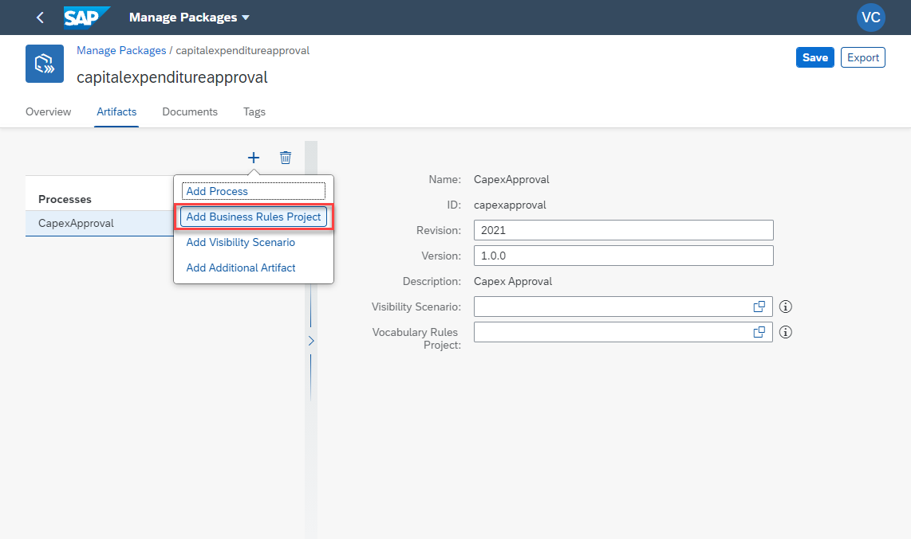
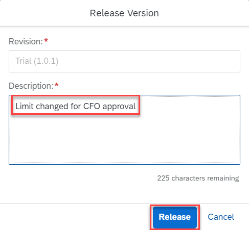

# Creating and Consuming Live Process Content Packages
## Table of Contents
- [Create Workflow Management Content Package](#contentpackage)
    - [Overview](#overview)
    - [Create Content Package](#createpackage)
- [Configure and Deploy Process Variant](#configureanddeploy)
  - [Create New Process Variant](#createvariant)
  - [Configure Process Variant](#configurevariant)
  - [Configure Decision](#configuredecision)
  - [Execute and Monitor Process Variant](#monitorvariant)
  - [Live Process Insights](#liveprocessinsights)
- [Summary](#summary)
   
## Create Workflow Management  Content Package <a name="contentpackage"></a>
### Overview <a name="overview"></a>
A Workflow Managment content package consists of Process Templates, Workflows, Business Rules, Process Visibility Scenario, Multi Target Application (MTA Archive) and Sources. A developer could also attach the related documents like setup, configuration and user guides. Each of the artifact in the package can be assigned a version and revision.
### Create Content Package <a name="createpackage"></a>
1. Open your SAP BTP Cockpit at https://cockpit.hanatrial.ondemand.com/
1. Navigate to your subaccount.
1. Select **Services -> Instances and Subscriptions**.
1. Click **Workflow Management**.

1. In the Fiori Launchpad open Manage Packages application. Click the tile **Manage Packages**.

1. The Manage Packages application is opened. Click **Create** button.

1. A new dialogue window opens. Enter the following data
    1. Namespace: **open.sap.com**
    1. Name: **capitalexpenditureapproval**
    1. Revision: **2021**
    1. Short Description: **Capital expenditure approval process package including process template, business rules and process visibility content.**
1. Click **Save** button.
   
The newly created package is now opened in the editor.
1. Add appropriate **Description**.

The various workflow management artifacts need to be included in this package.
1. Click tab **Artifacts**.
1. Click the **+** button.
1. Select **Add Processes**.

The dialogue shows all deployed process templates. 
1. Select **CapexApproval** and click **Select** button.

1. Enter Revision as **2021**
1. Enter Version as **1.0.0**  
Repeat the same for Business Rules and Process Visibility scenario.
1. Click tab **Artifacts**.  
1. Click the **+** button.  
1. Select **Add Business Rules Project**.

The dialogue shows all deployed Business Rules projects. 
1. Select **Capital Expenditure Rules** and click **Select** button.

1. Click tab **Artifacts**.  
1. Click the **+** button.  
1. Select **Add Process Visiblity Scenario**.  

The dialogue shows all deployed Process Visibility projects. 
1. Select **Capital Expenditure Approvals** and click **Select** button.

1. Enter Revision as **2021**
1. Enter Version as **1.0.0**
1. Click **Save** button to save the package.

*Your content package is ready to be consumed now or you could export your content package, to transport the content to another BTP subaccount*.
1. Click **Home** Button and navigate to the home page.


## Configure and Deploy Process Variants <a name="configureanddeploy"></a>
1. Click **Process Flexibility Cockpit** tile to configure and deploy a process variant.


*The Process Flexibility Cockpit enables business process experts to configure process variants, manage decisions and visibility scenarios. A single page to manage their process variants and monitor the performance*.
### Create New Process Variant<a name="createvariant"></a>
1. You can see the content package **capitalexpenditureapproval** which you have created in the Manage Packages application before. Click the tile **capitalexpenditureapproval**.

You can see the **Process Flexibility Cockpit** with all the artifacts in the content package. Since there is no process variant created and activated, all the tiles show the packaged artifacts. We will now create a new process variant tailored to our needs, based on the default variant.
1. Click the action **New Process Variant**.

A new dialogue window opens to provide the process variant name.
1. Enter a **name** to the process variant for example: capitalexpenditureapproval.
1. Select the process **CapexApproval**  from the dropdown, your process template.
1. Click **Create** button.  
  
The new process variant is available in the Process Variants tile with **Draft** state.

1. Click the header area of **Process Variants** tile.

### Configure Process Variant <a name="configurevariant"></a>
A process variant has default steps configured while creating the process template and it is possible to modify or add new steps.  
1. Click the Process Variant **capitalexpenditureapproval** to navigate to process variant editor.
  
*The Process Variant Editor is available now to configure a new variant. It shows the default variant and steps in the process template.*

1. Add a new step while moving **Approval Step** from the palette to the canvas between **Local Manager approval** and the **end event**. The default variant has two steps. The step details shows possible configurations you can do while configuring a step.

*It is possible to execute multiple step parallelly. You need to drag and drop the process step on an exisiting step so that two steps execute parallely*.
1. Select the newly added step and change the step **Name** to **CFO**.

1. Open the **Details** tab. In **approvalstep** maintain **CFO**.

*This is a step attribute you have configured while creating the process template. It is used while determining the approver using a business rule*.
1. Select **Group Head Approval** Step and select **Details** tab.
1. Update **approvalstep** with **GroupHead**.

1. Select **Local Manager Approval** step and make sure the **approvalstep** property is **LocalManager**.
1. Now save and activate your process variant. Click **Activate** button.

The successful activation of the process variant will display a toast message. A new workflow definition is deployed into your subaccount.


### Configure Decision <a name="configuredecision"></a>
1. Navigate to the Process Flexibility Cockpit, within **Decisions** tile select **Determine Approvers** to adapt the business rules to our needs.

1. Click **Copy to Draft** button to modify the business rule.

The copied draft version is now available.
1. Select the draft version.
1. Select the decision table **Determine Approvers Rule**.
1. Click **Edit** button.
1. Click the button (4) to enter the full screen mode.

1. Select the row with approval step name **GroupHead**.
1. Change the **Total Cost** to **>=15000**. This will include all three approval steps while executing the process variant.

1. Make sure the **User ID** column has your BTP user id for the Approval Step of the LocalManager, CFO and GroupHead.
1. Click **Save** button.

1. Click **Release Version** to release the changes.

1. Update **Description** and click **Release** button.

1. Select the new version (the one with status "Revised Content" directly under the one with status "Draft") and click **Activate** button.

Now you have modified the decision, activated and deployed it. 
1. Click **Home** button and navigate to the main page.


### Execute and Monitor Process Variant <a name="monitorvariant"></a>
In this section you will create an instance of the process variant you have activated. The process variant has now three approval steps and approvers are determined using the decision which you have modified in the previous section. 

1. Click **Monitor Workflows - Workflow Definitions** tile to view the newly deployed workflow definition.
  
You can see the newly activated process variant **capitalexpenditureapproval** deployed to your account. You can also see the approval steps you have built and deployed to your account.

1. Select the workflow definition **capitalexpenditureapproval**   and click **Start New Instance**.

1. **Copy  and Paste** the below JSON  content.
```json
{
    "RequestId": "CAPEX_REQ_001",
    "Title": "Build mobile apps",
    "Requester": {
        "Name": "Your Name",
        "UserId": "Your SAP BTP Trial User Id",
        "Comment": "Please Approve"
    },
    "Investment": {
        "Type": "Software",
        "Description": "Provide a fresh experience for our customers by providing new apps for our services",
        "TotalCost": 15000,
        "CAPEX": 10000,
        "OPEX": 5000,
        "ROI": 5,
        "Currency": "EUR",
        "BusinessUnit": "Purchasing",
        "Country": "Germany"
    }
}
```
1. Change your **Name** and **UserId** under Requester.
UserId needs to be your BTP trial user id.
1. Click **Start New Instance and Close**.

A new workflow instance of your activated process variant has been created.
1. Click **Show Instances** button to see the newly created workflow instance.

The Monitor Workflow Instances Application will show the root workflow instance. 
1. Click **EXECUTION LOG** to see the details of the activites executed so far.
The activity **Reference subflow "Group Head Approval" is started** shows the instance Id of the workflow approval step.
1. Click on the link **Instance Id** to navigate to the Group Head Approval step.

The child workflow instance **"ApprovalStep"** is displayed now.
1. Click **EXECUTION LOG**. It shows the Group Head approval task is ready and assigned to your BTP trial user id.

1. Navigate to **Home** screen and click **My Inbox** application. The newly created approval task is available to you as Group Head. 

1. Select the task and click **Approve** button to complete. You may also add a comment in the comment section.

1. Click **REFRESH** button to get the next approval task. This will update "My Inbox" with the next approval task.

1. Select the approval task **"...in your role as LocalManager**" and click **Approve** button. You may add comments in the comments section.

1. Click **REFRESH** button to get the next approval task. This will update "My Inbox" with the next approval task.

1. Select the approval task **"...in your role as CFO"** and click **Approve** button. You may add comments in the Comments section.


### Live Process Insights <a name="liveprocessinsights"></a>
SAP Workflow Management provides real time visibility into processes and deployed workflows. Process owners and process operators can get insights into their process variants. 
1. Navigate to **Process Flexiblity Cockpit** and click on **Live Process Insights**.

You will see status of your Workflow Instance including some key performance indicators you have modeled in the previous exercise. 
> Remember: in the [last exercise the default frequency for scheduling interval has been defined with 5 minutes for this process visibility scenario](https://github.com/SAP-samples/btp-workflow-management-opensap/tree/main/Week%203/Unit%202#monitor-visibility-scenarios). So it might take some time until you see the running instances there.


### Troubleshooting ###
In case you still don't see any data in the dashboard, you need to activate the process visibility scenario once again.
1. Underneath **Development Tools** select **Configure Visibility Scenarios**.

1. Open your scenario, e.g. **Capital Expenditure Approvals**.

1. Select **Activate**.

The scenario has been successfully activated and now you should also see the information in the dashboard in the process workspace as described above.


## Summary <a name="summary"></a>
Congratulations! In this excercise you have learned how to 
* Create a content package.
* Create a process variant.
* Configure a process variant and activate.
* Execute and Monitor Process Variants.
* Get Live Process Insights.
